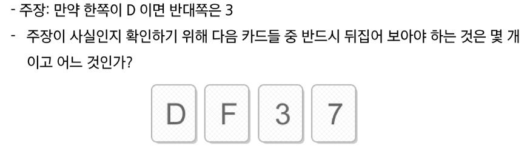
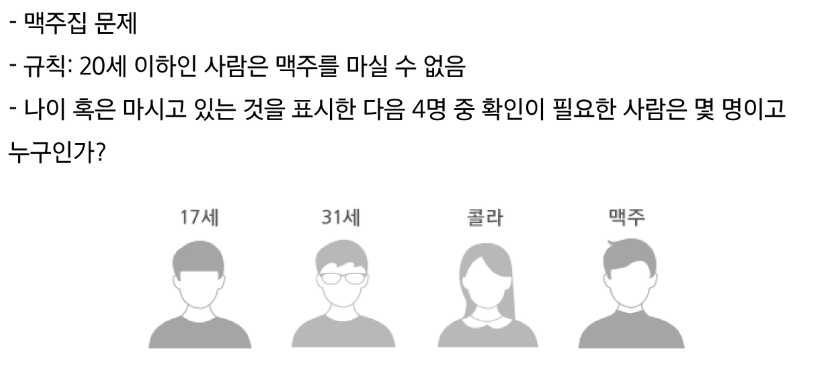
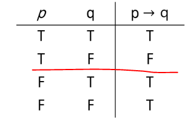
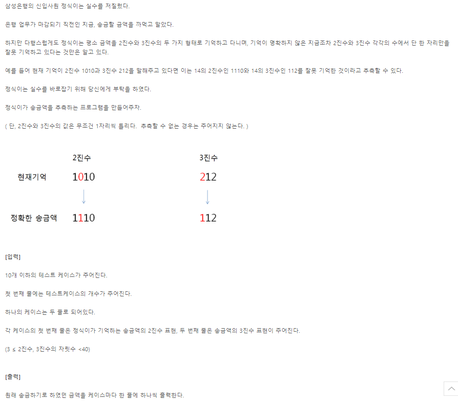

# 0829 온라인 실습

#### INDEX
```
0. 서론 - 프로그래밍과 논리/수학
1. 논리와 증명
2. 수와 표현
3. 집합과 조합론
4. 기초 수식
5. 재귀
6. 동적 프로그래밍
- problem
    - 정식이의 은행 업무 (swea_4366)
```

### 프로그래밍과 논리/수학
- 논리(Hard Logic)
    - 카드 문제
    - 사실 : 모든 카드의 한쪽에는 알파벳, 다른 쪽에는 숫자가 써 있음


    - 답 : D와 7
- 맥주집 문제
    - soft logic 사용
    
    - 답 : 17세, 맥주

- hard vs soft
    - 맥주집 문제 : 직관을 사용한 것

- 프로그래밍에서는 
    - hard logic 을 사용해야한다.

***
#### 참고
- 명제 : 참이나 거짓을 알 수 있는 식이나 문장
- 조건 명제 : p -> q


### 수와 표현
- 컴퓨터는 0/1을 표현할 수 있는 비트들을 모아 수를 표현
- k개의 비트를 사용하면 0부터 2^k-1 까지 표현가능

- 어떤 값 n을 표현하려면 몇개의 비트가 필요할까?
    - 2^k -1 >= n이 성립해야함 --> 즉 2^k >= n + 1
- 컴퓨터 분야에서 로그의 밑은 항상 2이다.


*** 
- problem
1. 정식이의 은행업무
