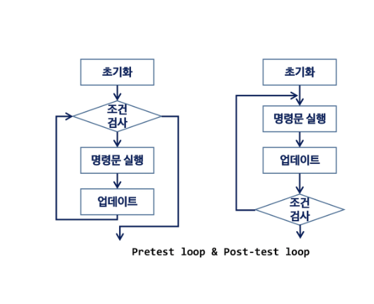
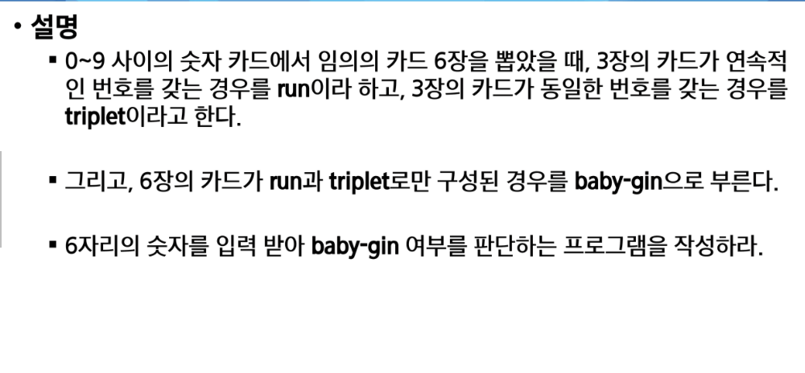
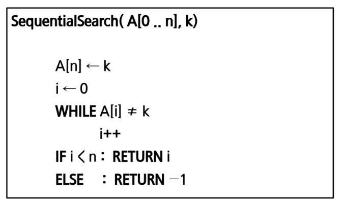
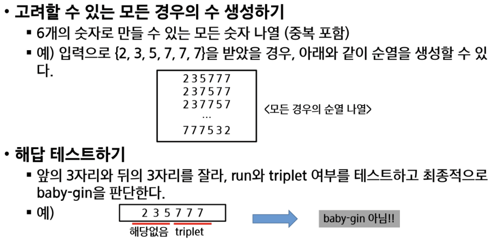

# 0830 온라인 실습

#### INDEX
```
- 반복과 재귀
- 완전 검색 기법
```

### 반복과 재귀
- 반복과 재귀는 유사한 작업을 수행할 수 있다.
- 반복은 수행하는 작업이 완료 될 때 까지 계속 반복
    - 루프 (for, while 구조)
- 재귀는 주어진 문제의 해를 구하기 위해 동일하면서 더 작은 문제의 해를 이용하는 방법
    - 하나의 큰 문제를 해결할 수 있는(해결하기 쉬운) 더 작은 문제로 쪼개고 결과들을 결합한다.
    - 재귀 함수로 구현

#### 반복 구조
- 초기화
    - 반복되는 명령문을 실행하기 전에 (한번만) 조건 검사에 사용할 변수의 초기값 설정
- 조건검사 (check control expression)
- 반복할 명령문 실행 (action)
- 업데이트 (loop update)
    - 무한 루프가 되지 않게 조건이 거짓이 되게 한다.


```python
def SelectionSort(A):
    n = len(A):

    for i in range(0,n-1):
        minI = i
        for j in range(i+1,n):
            if A[j] < A[minI]:
                minI = j
        A[minI], A[i] = A[i], A[minI]
```


- 재귀적 알고리즘
    - 재귀적 정의는 두 부분으로 나뉨
        - 1. 하나 또는 그 이상의 기본 경우(basis case or rule)
            - 집합에 포함 되어있는 원소로 induction을 생성하기 위한 시드 역할
        - 2. 하나 또는 그 이상의 유도된 경우 (inductive case or rule)
            - 새로운 집합의 원소를 생성하기 위해 결합되어지는 방법

- 재귀함수 (recursive function)
    - 재귀적 정의를 이용해서 재귀 함수 구현
    - 기본부분 / 유도부분
    - 함수 호출 -> 프로그램 메모리 구조에서 스택을 이용 . 따라서 재귀 호출은 반복적인 스택의 사용을 의미해서 메모리 및 속도에서 성능저하가 발생한다.

***
<예시>

#### 팩토리얼 재귀 함수
- 재귀적 정의:
    Basis rule:
        N <= 1 경우, n = 1
    Inductive rule:
        N > 1, n != n * (n-1)!

- n!에 대한 재귀 함수:
    ```python
    def fact(n):
        if n <= 1:
            return 1
        else:
            return n * fact(n-1)
    
    ```

### 완전 검색 기법

#### Baby-gin Game



- 667767 = 두개의 triplet -> Baby - Gin 이다.
- 101123 은 한개의 triplet이 존재하나, 023이 run 이 아니므로 baby-gin은 아니다.
- (123을 run으로 사용하더라도 011이 run이나 triplet 이 아님)

#### 접근 방법
- 1. brute-force(고지식한 방법):
    - 자료들의 리스트에서 키 값을 찾기 위해 첫번째 자료부터 비교하면서 진행한다.
    

- 2. 완전 검색
    - 수행속도는 느리지만 해답은 찾아냄
    - 이를 기반으로 그리디나 동적 계획법을 이용해서 효율적인 알고리즘 방법을 찾자!

    - 완전 검색을 이용한 접근 법
        - 고려할 수 있는 모든 경우의 수 생성
        - 해답 테스트하기
        

***

실습 문제 :

- swea 5188. 최소 합
- swea 5189. 전자카트
- swea 1861. 정사각형 방
