# 0904 온라인 실습

## <em> INDEX </em>
    - 웹 소개
    - 웹 구조화
        - HTML
        - HTML의 구조
        - 텍스트 구조
    - 웹 스타일링
        - CSS
        - CSS 선택자
        - 우선 순위

### 1. 웹 소개
```
World Wide Web : 인터넷으로 연결된 컴퓨터들이 정보를 공유하는 거대한 정보 공간

Web : Web site, Web application등을 통해 사용자들이 정보를 검색하고 상호 작용하는 기술

Web Site : 인터넷에서 여러개의 Web Page가 모인 것으로, 사용자들에게 정보나 서비스를 제공하는 공간

Web Page : HTML, CSS 등의 웹 기술을 이용해서 만들어진, Web Site를 구성하는 하나의 요소
```


Web Page 구성 요소
- Steel Frame (<mark><span style='color:red'>STRUCTURE</span></mark>) : <STRONG>HTML</STRONG>
- Paint (<mark><span style='color:blue'>STYLING</span></mark>) : <STRONG>CSS</STRONG>
- Turn on light (<mark><span style='color:black'>BEHAVIOR</span></mark>) : <STRONG>JS</STRONG>

***

### 2. 웹 구조화

#### - HTML

- <STRONG>HTML</STRONG> : HyperText Markup Language
    - 웹 페이지의 의미와 구조를 정의하는 언어

    - Hypertext : 웹 페이지를 다른 페이지로 연결하는 링크, 참조를 통해 사용자가 한 문서에서 다른 문서로 즉시 접근 할 수 있는 텍스트
    - Markup Language : 태그 등을 이용하여 문서나 데이터의 구조를 명시하는 언어 
        - HTML, Markdown
        

#### - HTML의 구조
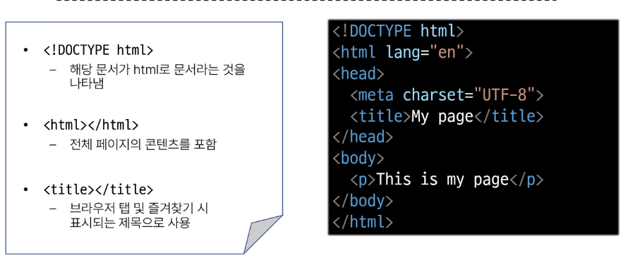

```
- <!DOCTYPE html> : 해당 문서가 html로 문서라는 것을 나타냄
- <html></html> : 전체 페이지의 콘텐츠를 포함
- <title></title> : 브라우저 탭 및 즐겨찾기 시 표시되는 제목으로 사용
- <head></head> : html 문서에 관련된 설명, 설정 등 / 사용자에게 보이지 않음
-<body></body> : 페이지에 표시되는 모든 콘텐츠
```

- HTML의 요소 :
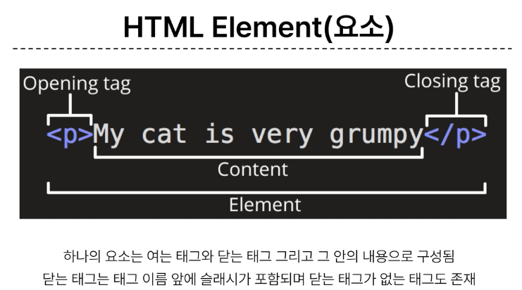
- HTML의 속성 : 
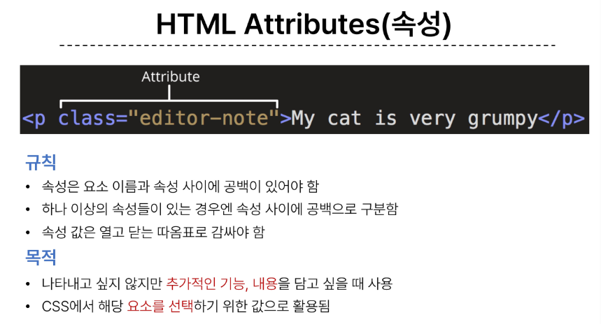
    - 규칙 :
        - 속성은 요소 이름과 속성사이에 공백이 있어야 함
        - 하나 이상의 속성들이 있는 경우엔 속성 사이에 공백으로 구분함
        - 속성 값은 열고 닫는 따옴표로 감싸야 함
    - 목적 : 
        - 나타내고 싶지 않지만 추가적인 기능, 내용을 담고 싶을 때 사용
        - CSS에서 해당 요소를 선택하기 위한 값으로 활용됨

#### - HTML TEXT의 구조

- HTML Text structure :
    - HTML의 주요 목적 중 하나는 텍스트 구조와 의미를 제공하는 것
```
- Heading & Paragraphs : 
    - h1~6 , p

- Lists:
    - ol, ul, li

- Emphasis & Importance : 
    - em, strong
```

### 3. 웹 스타일링

#### CSS

- CSS (Cascading Style Sheet):
    - 웹 페이지의 디자인과 레이아웃을 구성하는 언어

```
CSS 구문

h1 {
    color: blue;
    font-size: 30px;
}
```
- h1[선택자]
- color: red;[선언]
- font-size[속성]
- 30px[값]

- CSS 적용 방법

1. 인라인(Inline) 스타일
    - HTML 요소 안에 style 속성 값으로 작성
    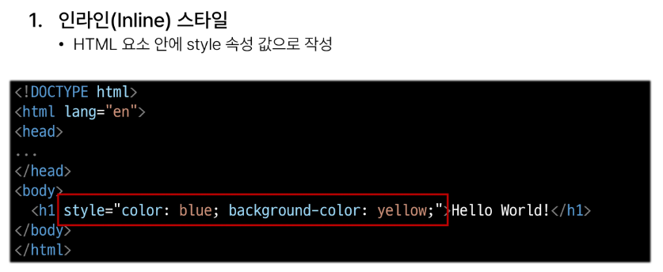
2. 내부(Internal) 스타일
    - head 태그 안에 style 태그에 작성
    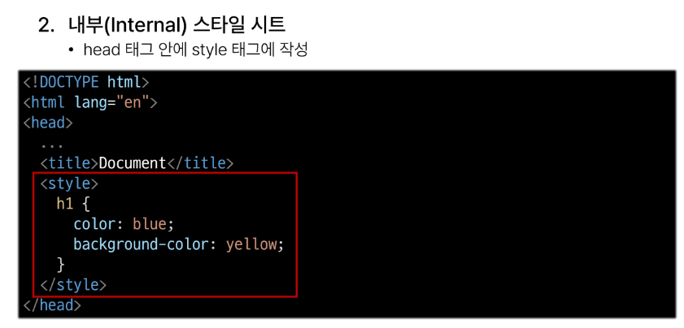
3. 외부(External) 스타일
    - 별도의 CSS 파일 생성 후 HTML link 태그를 사용해서 불러오기
    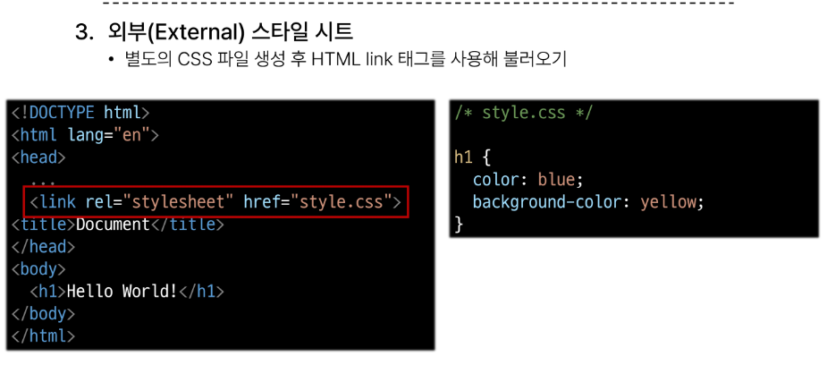

#### CSS 선택자

- CSS Selectors : HTML 요소를 선택하여 스타일을 적용 할 수 있도록 하는 선택자
```
CSS 선택자 종류
- 기본 선택자:
    - 전체(*) 선택자 
    : HTML 모든 요소를 선택
    - 요소(tag) 선택자
    : 지정한 모든 태그를 선택
    - 클래스(class) 선택자
    : ('.'(DOT)) 주어진 클래스 속성을 가진 모든 요소를 선택
    - 아이디(id) 선택자
    : ('#') 주어진 아이디 속성을 가진 요소 선택
    : 문서에는 주어진 아이디를 가진 요소가 하나만 있어야 함  
    - 속성(attr) 선택자 등

- 결합자(Combinators):
    - 자손 결합자(""(space))
    : 첫 번째 요소의 자손 요소들 선택
    : 예 > p span은 <p> 안에 있는 모든 <span>을 선택 (하위 레벨 상관없이)
    - 자식 결합자(>)
    : 첫 번째 요소의 직계 자식만 선택
    : 예 > ul > li은 <ul> 안에 있는 모든 <li>를 선택 (한 단계 아래 자식들만)
```
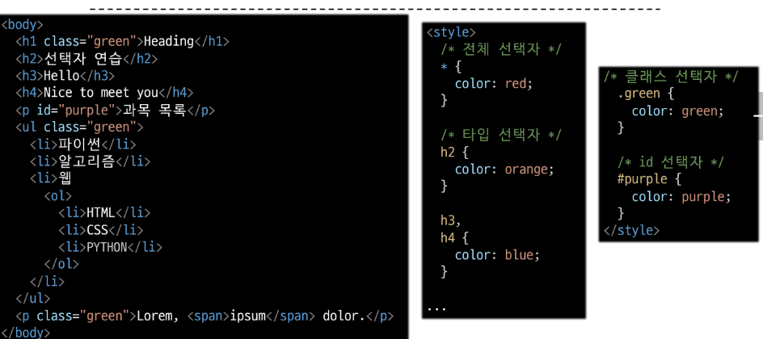
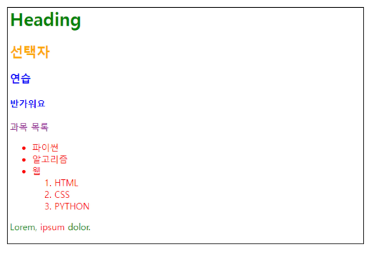
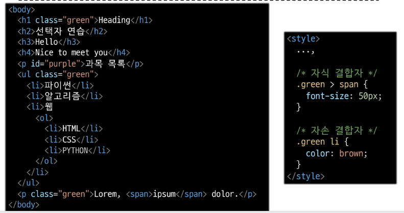
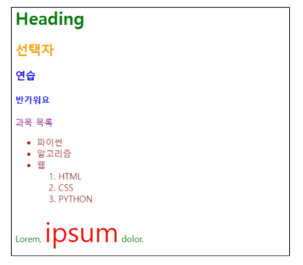

#### 우선 순위

- 동일한 요소에 적용 가능한 같은 스타일을 두 가지 이상 작성 했을 때 어떤 규칙이 적용 되는지 결정하는 것
- Cascade (계단식) : 동일한 우선순위를 갖는 규칙이 적용될 때 CSS에서 마지막에 나오는 규칙이 사용됨

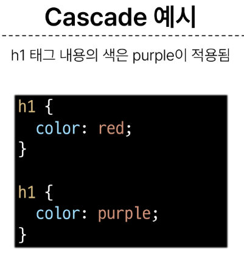
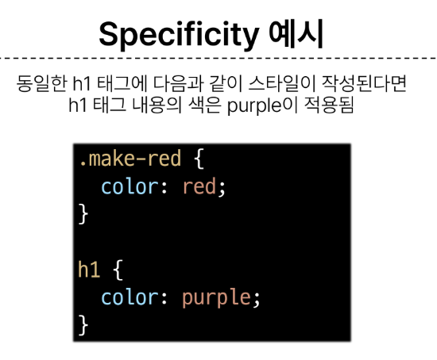

```
우선순위가 높은 순

1. Importance --> !important
2. Inline 스타일
3. 선택자 --> ID 선택자 > CLASS 선택자 > 요소 선택자
4. 소스 코드 순서
```

***

#### 상속

- CSS 상속 : 기본적으로 CSS는 상속을 통해 부모 요소의 속성을 자식에게 상속해 재사용성을 높인다

```
상속 여부

- 상속되는 속성 : TEXT 관련 요소 (font, color, text-align), opacity, visibility 등
- 상속되지 않는 속성 : Box model 관련 요소(width, height, border, box-sizing ...) /
position 관련 요소(position, top/right/bottom/left, z-index) 등
```

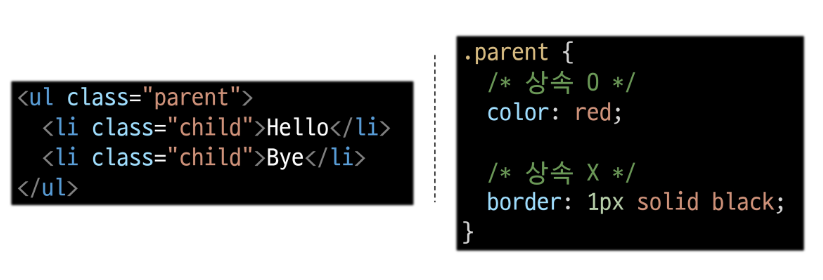
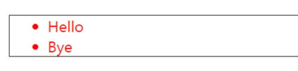

~~참고~~:
- HTML 관련 사항 : 
    - 요소(태그) 이름은 대소문자를 구분하지는 않지만, 소문자 사용 권장
    - 큰 따옴표 권장
    - 프로그래밍 언어와 달리 에러 반환 안하기 때문에 작성시 주의하자

- CSS 인라인 스타일 사용 지양 : 
    - CSS 와 HTML 구조 정보가 혼합되어서 코드가 이해하기 어려움

- 속성은 되도록 CLASS만 사용
    - ID, 요소 선택자 등 여러 선택자들과 함께 사용할 경우 우선순위 규칙에 따라 예기치 못한 스타일 규칙이 적용되어 전반적인 유지보수가 어렵다
    - 문서에서 단 한번 유일하게 적용될 스타일의 경우에만 ID 선택자 사용을 고려할 것