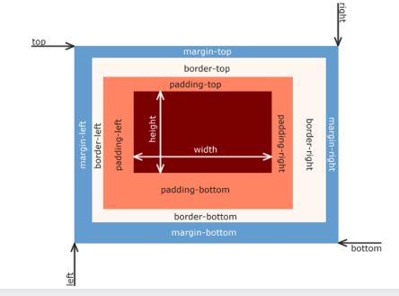
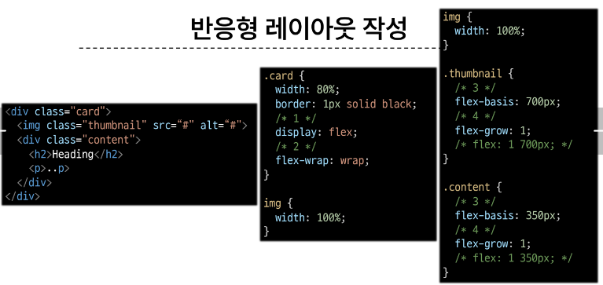
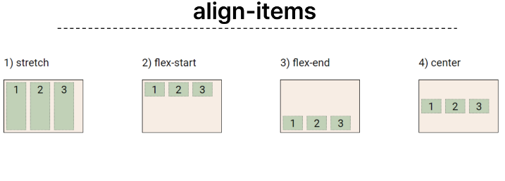

# 0905 온라인 실습

## <em> INDEX </em>
    - CSS Box Model
        - 구성 요소
        - 박스 타입
        - 기타 display 속성
    - CSS Layout Position
        - CSS Position
    - CSS Layout Flexbox
        - 구성 요소
        - 레이아웃 구성

### 1. CSS Box Model

```
모든 HTML 요소를 사각형 박스로 표현하는 개념

/ 원이 아니라 네모 박스를 깎은 형태
```

#### - 구성 요소

- <STRONG>CSS Box Model</STRONG> :
    - 모든 HTML 요소를 사각형 박스로 표현하는 개념
    - <mark><span style='color:black'>내용(CONTENT)</span></mark>
    - <mark><span style='color:black'>안쪽 여백(PADDING)</span></mark>
    - <mark><span style='color:black'>외부 간격(MARGIN)</span></mark>


- Margin : 지금 있는 박스와 다른 요소 사이의 공백 -- 가장 바깥쪽의 영역
- Border : 콘텐츠와 패딩을 감싸는 테두리 영역
- Padding : 콘텐츠 주위에 위치하는 공백의 영역
- Content : 콘텐츠가 표시되는 영역



BOX의 구성 예시


# border width 는 선굵기


- width & heigh 속성 : 
    - 요소의 너비와 높이를 지정
    - 이 때 지정되는 요소의 너비와 높이는 콘텐츠 영역을 대상으로 함
    
    
    
- Box sizing
    - content-box
    - border-box
    - 
    - 


#### - 박스 타입

- Block & Inline


- EXAMPLE
    - 
    - 

```
Block 타입의 특징

- 항상 새로운 행으로 나뉨
- width 와 height 속성을 사용해서 너비와 높이를 지정할 수 있음
- 기본적으로 width 속성을 지정하지 않으면 박스는 inline 방향으로 사용 가능한 공간을 모두 차지함 (너비를 사용가능한 공간의 100%로 채우는 것)
- 대표적인 block 타입 태그 
    - h1~6, p, div
```
```
Inline 타입의 특징

- 새로운 행으로 나뉘지 않음
- width 와 height 속성을 사용할 수 없음
- 수직 방향 
    - padding, margins, borders 가 적용되지만 다른 요소를 밀어낼 수는 없음
- 수평 방향
    - padding, margins, borders 가 적용되어 다른 요소를 밀어낼 수 있음
- 대표적인 inline 타입의 태그
    - a, img, span
```


#### - 기타 display 속성

1. inline-block
    - inline과 block 요소 사이의 중간 지점을 제공하는 display 값
    - block 요소의 특징을 가짐
        - width 및 height 속성 사용 가능
        - padding, margin 및 border 로 인해 다른 요소가 밀려남
### ** 요소가 줄 바꿈 되는 것을 원하지 않으면서 너비와 높이를 적용하고 싶은 경우에 사용한다. **


2. none 
    - 요소를 화면에 표시하지 않고, 공간조차 부여되지 않음


### 2. CSS Layout Position
```
CSS Layout :
각 요소의 위치와 크기를 조정하여 웹 페이지의 디자인을 결정하는 것
- Display, Position, Float, Flexbox 등
```
```
CSS Position : 
요소를 Normal Flow에서 제거하여 다른 위치로 배치하는 것
- 다른 요소 위에 올리기, 화면의 특정 위치에 고정시키기 등
```
#### -CSS Position
```
Position 유형 
    1. static

        - 기본값
        - 요소를 Normal Flow 에 따라 배치
        
    2. relative

        - 요소를 Normal Flow 에 따라 배치
        - 자기 자신을 기준으로 이동
        - 요소가 차지하는 공간은 static일 때와 같음

    3. absolute

        - 요소를 Normal Flow 에서 제거
        - 가장 가까운 relative 부모 요소를 기준으로 이동
        - 문서에서 요소가 차지하는 공간이 없어짐

    4. fixed

        - 요소를 Normal Flow에서 제거
        - 현재 화면 영역 (viewport)를 기준으로 이동
        - 문서에서 요소가 차지하는 공간이 없어짐

    5. sticky

    - 요소를 Normal Flow에 따라 배치
    - 요소가 일반적인 문서 흐름에 따라 배치되다가 스크롤이 특정 임계점에 도달하면 그 위치에서 고정됨(fixed)
    - 만약 다음 sticky 요소가 나오면 다음 sticky 요소가 이전 sticky 요소의 자리를 대체
        - 이전 sticky 요소가 고정되어 있던 위치와 다음 sticky 요소가 고정되어야 할 위치가 겹치게 되기 때문
```


***


### 실제 사용 예시


### z-index
- 요소가 겹쳤을 때 어떤 요소 순으로 위에 나타낼 지 결정
```
특징 :
- 정수 갑을 사용해 Z축 순서를 지정
- 더 큰 값을 가진 요소가 작은 값의 요소를 덮음
```
#### z-index 사용 예시


### 3. CSS Layout Flexbox
- 요소를 행과 열 형태로 배치하는 1차원 레이아웃 방식
- '공간배열' & '정렬'


- flexbox 의 기본 사항


```

main axis (주 축):
    - flex item 들이 배치되는 기본 축
    - main start 에서 시작해서 main end 방향으로 배치

cross axis (교차 축):
    - main axis 에 수직인 축
    - cross start 에서 시작하여 cross end 방향으로 배치

flex container :
    - display : flex; 혹은 display: inline-flex; 가 설정된 부모 요소
    - 이 컨테이너의 1차 자식 요소들이 Flex Item이 됨
    - flexbox 속성 값들을 사용하여 자식 요소 Flex Item 들을 배치

flex item : 
    - Flex Container 내부에 레이아웃 되는 항목

```

1. Flex Container 지정
    - flex item은 기본적으로 행으로 나열
    - flex item은 주축의 시작 선에서 시작
    - flex item은 교차축의 크기를 채우기 위해 늘어남

    

2. Flex-direction 지정
    - flex item이 나열되는 방향을 지정
    - column으로 지정할 경우 주 축이 변경됨
    - -reverse로 지정하면 시작 선과 끝 선이 서로 바뀜

    

3. flex-wrap 
    - flex item 목록이 flex container의 하나의 행에 들어가지 않을 경우 다른 행에 배치할지 여부 설정

    

4. justify-content
    - 주 축을 따라 flex item과 주위에 공간을 분배

    

5. align-content
    - 교차 축을 따라 flex item과 주위에 공간을 분배
        - flex-wrap이 wrap 또는 wrap-reverse로 설정된 여러 행에만 적용됨
        - 한 줄짜리 행에는 효과가 없다.

    

6. align-items
    - 교차 축을 따라 flex item 행을 정렬
        
    

 
7. align-self
    - 교차 축을 따라 개별 flex item 을 정렬
        
    

```
flexbox 속성

- Flex Container 관련 속성
    - display , flex-direction, flex-wrap, justify-content, align-items, align-content

- Flex Item 관련 속성
    - align-self, flex-grow, flex-basis, order
```

목적에 따른 분류 ;
- 배치 : flex-direction, flex-wrap
- 공간 분배 : justify-content, align-content
- 정렬 : align-items, align-self

속성명 -->> 
1. justify (주 축)
2. align (교차 축)

8. flex-grow
    - 남는 행 여백을 비율에 따라 각 flex item에 분배
        - 아이템이 컨테이너 내에서 확장하는 비율을 지정
    - flex-grow의 반대는 flex-shrink

    
    

9. flex-basis
    - flex item의 초기 크기 값을 지정
    - flex-basis와 width 값을 동시에 적용한 경우 flex-basis가 우선

    
    

#### -flex-wrap 응용

- 반응형 레이아웃 : 다양한 디바이스와 화면 크기에 자동으로 적응하여 콘텐츠를 최적으로 표시하는 웹 레이아웃 방식

    
    

***

정리 :

1. flex-direction
    1. row
    2. row-reverse
    3. column
    4. column-reverse

    
2. flex-wrap
    1. wrap
    2. nowrap

    
3. justify-content
    1. flex-start
    2. flex-end
    3. ceter
    4. space-between
    5. space-around
    6. space-evenly

    
4. align-content
    1. flex-start
    2. flex-end
    3. center
    4. space-between
    5. space-around
    6. space-evenly

    

5. align-items
    1. stretch
    2. flex-start
    3. flex-end
    4. center

    

6. align-self
    1. stretch
    2. flex-start
    3. flex-end
    4. center

    

*** 
## 참고

- <em>Shorthand 속성 </em>
    - border :
        - border-width, border-style, border-color를 한번에 설정하기 위한 속성 
    ```
    /* 작성 순서는 영향을 주지 않음 */

    border : 2px solid black;
    ```
    - margin & padding : 
        - 4 방향의 속성을 각각 지정하지 않고, 한번에 지정할 수 있는 속성
        ```
        /* 4개 - 상우하좌 */
        margin : 10px 20px 30px 40px;
        padding : 10px 20px 30px 40px;

        /* 3개 - 상/좌우/하 */
        margin : 10px 20px 30px;
        padding : 10px 20px 30px;

        /* 2개 - 상하/좌우 */
        margin : 10px 20px;
        padding : 10px 20px;

        /* 1개 - 공통 */
        margin : 10px;
        padding : 10px;
        ```

    - margin collapsing (마진 상쇄) :
        - 두 block 타입 요소의 margin top과 bottom이 만나 더 큰 margin으로 결합되는 현상
        - 웹 개발자가 레이아웃을 더욱 쉽게 관리 할 수 있도록 함
            - 각 요소에 대한 상/하 margin을 각각 설정하지 않고, 한 요소에 대해서만 설정하기 위함
    