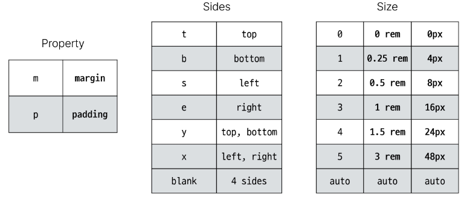
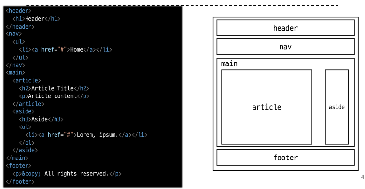
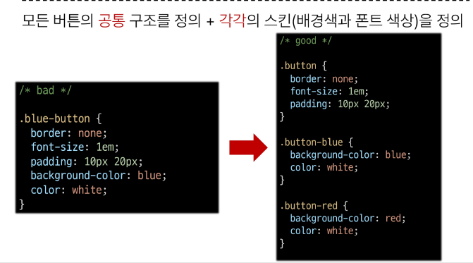
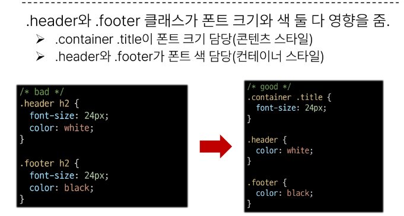
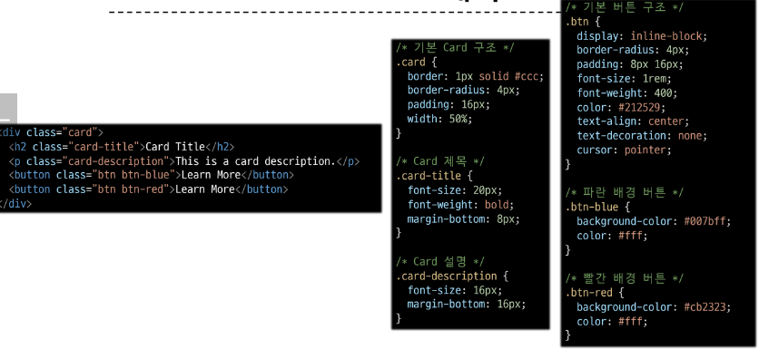

# 0906 온라인 실습

## <em> INDEX </em>
    - Bootstrap
        - 개요
        - Typography
        - Colors
        - Component
    - Semantic Web
        - 개요
        - Semantic in HTML
        - Semantic in CSS

### 1. BOOTSTRAP

#### - 개요
```
CSS 프론트엔드 프레임 워크 (ToolKit)
--> 미리 만들어진 다양한 디자인 요소들을 제공하여 웹 사이트를 빠르고 쉽게 개발 할 수 있도록 함
```
```
기본 사용법 :
<p class='mt-5'>Hello, world!</p>
```
Bootstrap 기본 사용법 :
## <span style='color:red'>m</span><span style='color:blue'>t</span>-<span style='color:black'>5</span>
- M : PROPERTY
- T : SIDES
- 5: SIZE



#### - Typography

- Bootstrap 에는 특정한 규칙이 있는 클래스 이름으로 이미 스타일 및 레이아웃이 작성되어있다

- Typography : 제목, 본문 텍스트, 목록 등
```
<!--Display Heading-->
<h1 class='display-1'>Display 1</h1>

<!--Inline text elements-->
<p><del>This line of text is meant to be deleted</del></p>
<mark></mark> - highlight
<ins></ins> - 인용구
<u></u> - 밑줄

<!--Lists->
ul > li*4
```

#### - Colors

- Bootstrap이 지정하고 제공하는 색상 시스템
- text colors, background colors, ...

#### - Component

- Bootstrap 에서 제공하는 UI 관련 요소
    - 버튼 , 네비게이션 바, 카드 , 폼, 드롭다운

### 2. Semantic Web

- 웹 데이터를 의미론적으로 구조화된 형태로 표현하는 방식
- 검색 엔진 및 개발자가 웹 페이지 콘텐츠를 이해하기 쉽도록

```
- header
- nav
- main
- article
- section
- aside
- footer
```



#### - Semantic in CSS

- OOCSS (Object Oriented CSS) :
    - 객체 지향적 접근법을 적용하여 CSS를 구성하는 방법론
    - CSS를 효율적이고 유지 보수가 용이하게 작성하기 위한 일련의 가이드라인

    - 기본 원칙
        - 1. 구조와 스킨을 분리
            - 구조와 스킨을 분리함으로써 재사용 가능성을 높임 
            - 모든 버튼의 공통 구조를 정의, 각각의 스킨을 정의
        - 2. 컨테이너와 콘텐츠를 분리
            - 객체에 직접 적용하는 대신 객체를 둘러싸는 컨테이너에 스타일을 적용
            - 스타일을 정의할 때 위치에 의존적인 스타일을 사용하지 않도록 함
            - 콘텐츠를 다른 컨테이너로 이동시키거나 재배치 할 때 스타일이 깨지는 것을 방지

    
    
- 예시


***
## 참고

CDN (Content Delivery Network) :
- 지리적 제약 없이 빠르고 안전하게 콘텐츠를 전송할 수 있는 전송 기술
- 서버와 사용자 사이의 물리적 거리를 줄여 콘텐츠 로딩에 소요되는 시간을 최소화
- 지리적으로 사용자와 가까운 CDN 서버에 콘텐츠를 저장해서 사용자에게 전달

#### 의미론적인 마크업의 이점
- '검색엔진 최적화 (SEO)'
    - 검색 엔진이 해당 웹 사이트를 분석하기 쉽게 만들어 검색 순위에 영향을 줌
- '웹 접근성 (Web Accessibility)'
    - 시각 장애 사용자가 스크린 리더기로 웹 페이지를 사용할 때 추가적으로 도움