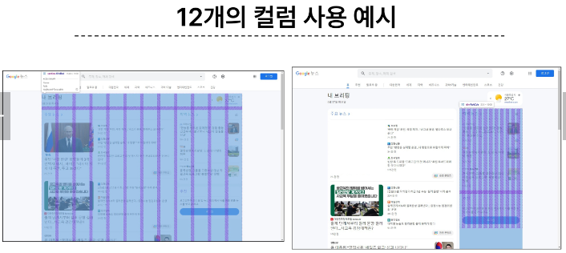
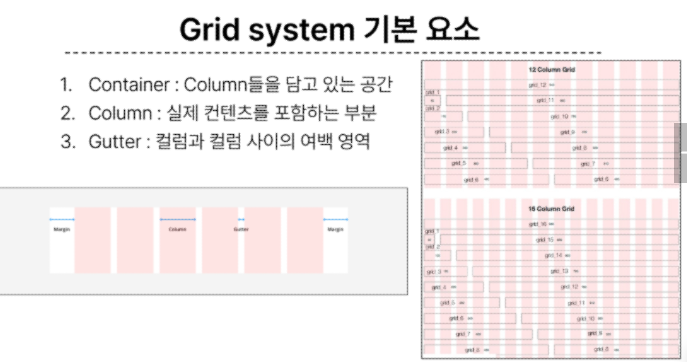
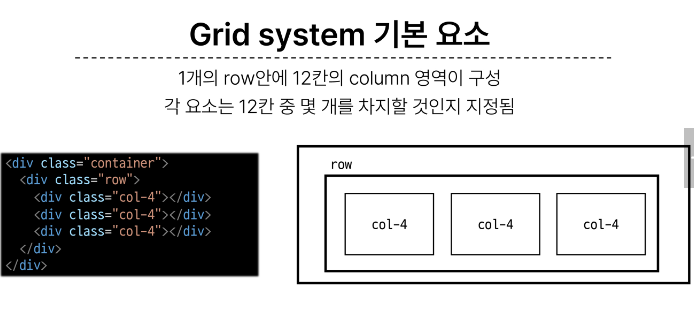
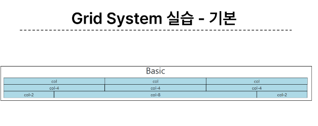
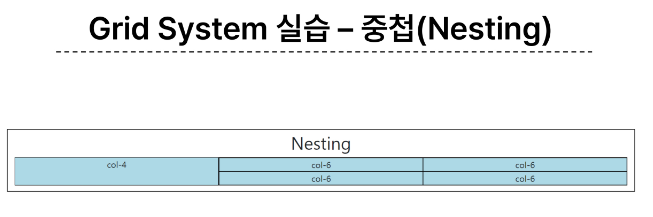
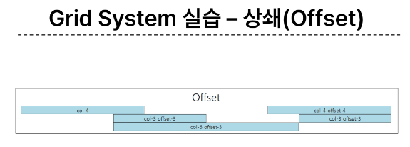

# 0907 온라인 실습

## <em> INDEX </em>
    - Bootstrap Grid System
        - 개요
        - Grid system 클래스와 기본 구조
    - Grid system for responsive web
        - 개요
        - Grid system Breakpoints

### 1. Bootstrap Grid System

- Bootstrap Grid System이란?
```
웹 페이지의 레이아웃을 조정하는 데 사용되는 12개의 컬럼으로 구성된 시스템
```
- Bootstrap Grid System의 목적은?
```
반응형 디자인을 지원해 웹 페이지를 모바일, 테블릿, 데스크탑 등 다양한 기기에서 적절하게 표시할 수 있도록 도움
```



#### - Grid system의 기본 요소

1. Container :
    - Column들을 담고 있는 공간
2. Column : 
    - 실제 컨텐츠를 포함하는 부분
3. Gutter :
    - 컬럼과 컬럼 사이의 여백 영역



- 1개의 row 안에 12칸의 column 영역이 구성, 
- 각 요소는 12칸 중 몇 개를 차지할 것인지 지정이 됨




*** 
grid system 실습 -

1. 기본


2. 중첩


3. 상쇄


- GUTTERS 
    - Grid system에서 column 사이에 여백 영역, 
    - x 축은 padding, y 축은 margin 으로 여백 생성

- 실습


***
### 2. Grid system for responsive web