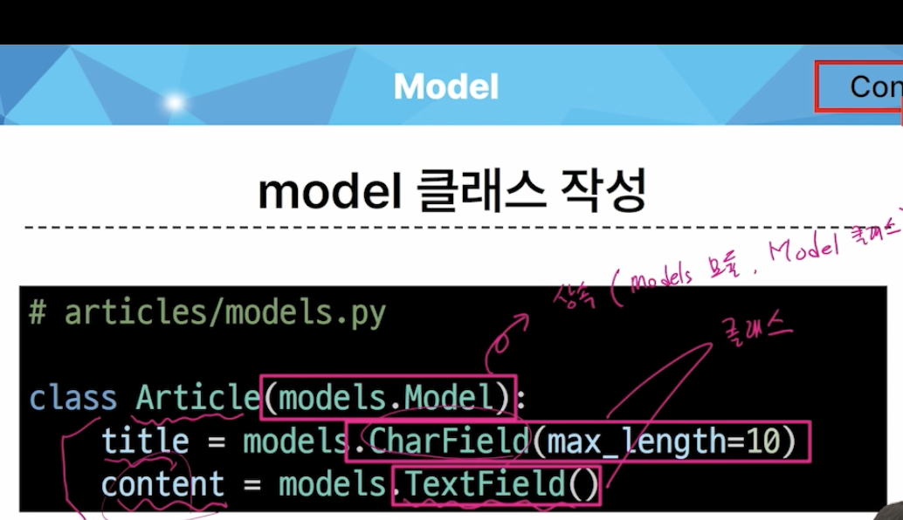
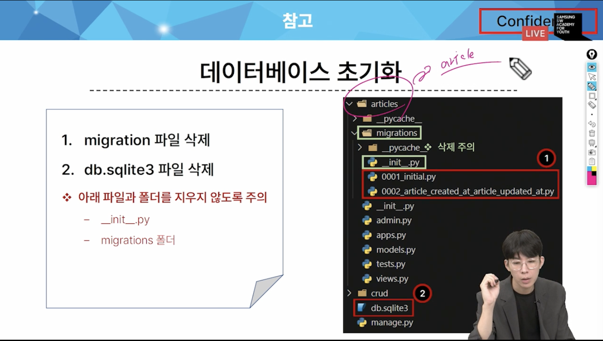

# 0914 복습

1. model 클래스 작성
    - models.Model ( 상속, models라는 모듈에서 Model 클래스를 가져옴)
    - CharField, TextField ( 클래스 )
    - Article 클래스

- 모델클래스 == 테이블 설계도
- DB에 생성될 테이블 
- 개발자는 테이블 구조를 어떻게 설계할지에 대한 코드만 작성하면 됨 ( 프레임 워크의 이점 )
- title, content 줄은 열을 만들 뿐
- 클래스 변수 명 : 테이블의 각 '필드(열)이름' (title, content)
- model field class : 테이블 필드의 "데이터 타입" (CharField, TextField) -> 데이터 베이스의 제약 조건이 들어갈 수 있음

2. migrations

- model 클래스의 변경사항(필드 생성, 수정 삭제등) 을 DB에 최종 반영하는 방법
- DB 언어 : SQL 을 쓰고 있기 때문에,
- 파이썬 명령어 -> DB 명령어로 만드는 과정: makemigrations
- DB를 최종 반영 : migrate
- 명령어 기억 필수 (2가지)
    1. makemigrations:
        - $python manage.py makemigrations
    2. migrate
        - $python manage.py migrate

3. db.sqlite3
    - articles.article (앱이름, 우리가 붙인이름)

4. 이미 생성된 테이블에 필드를 추가해야한다면?
    - created_at , updated_at
    - 제약 조건 : auto_now_add , auto_now 를 둘다 True 로 만듦
    - default 값을 설정해야하기 때문에 바로 추가안됨
        - django에서 제공해주는 내부 모듈의 값으로 치환 가능
    - 2번 설계도는 1번 설계도에 의존하고 있음
        - 따라서 1번 설계도를 지우면 2번 설계도가 제대로 안 됨

5. django 설계도에 추후 문제가 생겼을 때 복구하거나 되돌릴 수 있도록 쌓아나간다.

6. 모델 클래스에 변경사항이 생겼다면, 반드시 새로운 설계도를 생성하고, 이를 DB에 반영해야한다.

7. MODEL FIELD
    - CharField(): 길이의 제한이 있는 문자열을 넣을 때 사용(필드의 최대길이를 결정하는 max_length는 필수 인자)
    - TextField(): 글자의 수가 많을 때 사용
    - DateTimefield:
        - auto_now : 데이터가 저장될 때마다 자동으로 현재 날짜 시간을 저장 (수정할 때 사용)
        - auto_now_add : 데이터가 처음 생성될때만 자동으로 현재 날짜시간을 저장 (작성일)

8. Admin site
- Automatic admin interface: Django는 추가 설치 없이 자동으로 관리자 인터페이스를 제공
    - 데이터 확인 및 테스트 등을 진행하는데 매우 유용

***
- 데이터 베이스 초기화

- migtrations 기타 명령어

- $python manage.py showmigrations
    - migrations 파일들이 migrate 됐는지 안됐는지 여부
    - [x] 표시가 있으면 migrate가 완료되었음을 의미
- $python manage.py sqlmigrate articles 0001
    - 해당 migrations 파일이 sql언어(DB가 사용하는 언어)로 어떻게 번역되어 DB에 전달되었는지 확인하는 명령어

- 첫 migrate 시에 출력 내용이 많은 이유는?
    - Django 프로젝트가 동작하기 위해 미리 작성되어있는 기본 내장 app들에 대한 migration파일들이 함께 migrate되기 때문에

### CRUD
- 소프트웨어가 가지는 기본적인 데이터 처리 기능
- create(저장)
- read(조회)