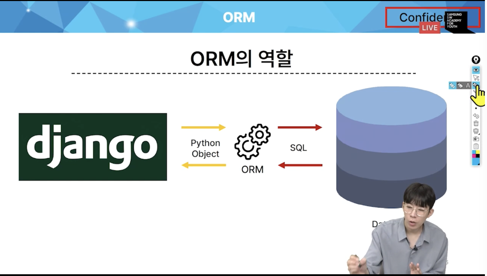
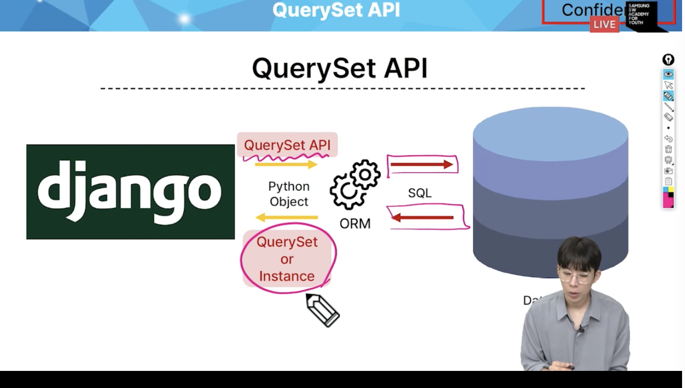
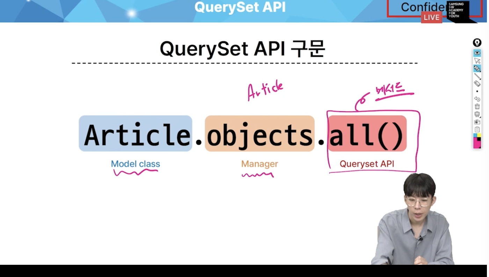
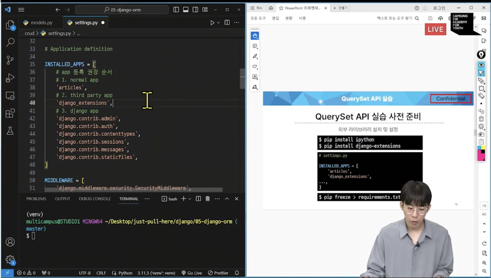
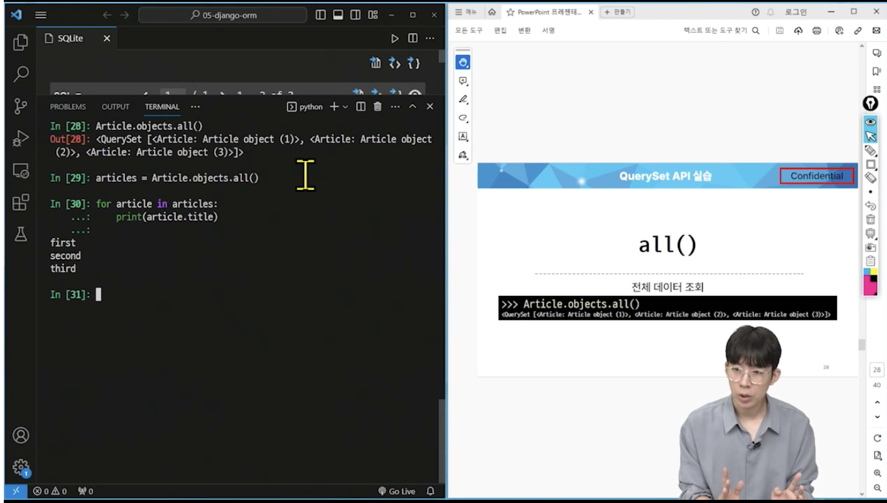
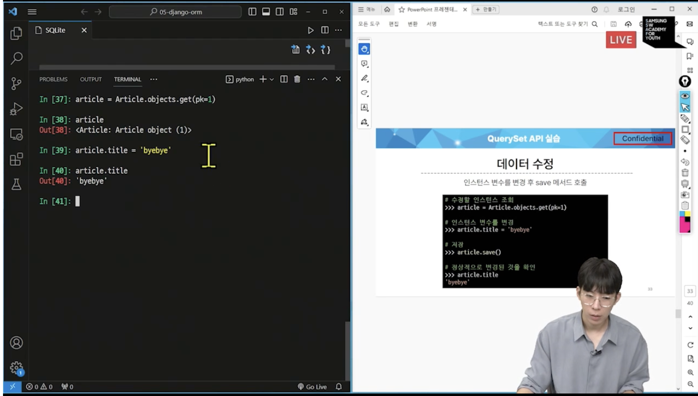
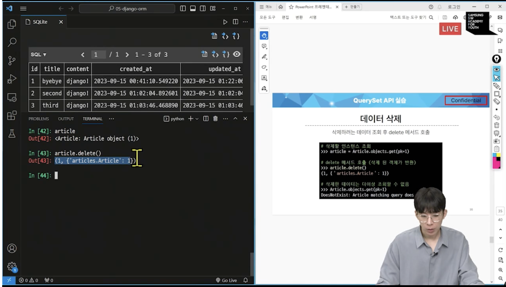

# 0915 온라인 실습

#### INDEX
```
1. ORM
2. QuerySet API
3. QuerySet API 실습
    1. Create
    2. Read
    3. Update
    4. Delete
```

## 1. ORM
- 객체 지향 프로그래밍 언어를 사용하여 호환되지 않는 유형의 시스템 간에 데이터를 변환하는 기술

- 파이썬(장고) <-> SQL(DB)
- 장고에 내장된 ORM 을 통해서 소통할 수 있다.


## 2. QuerySet API

- ORM에서 테이터를 검색, 필터링, 정렬 및 그룹화 하는데 사용하는 도구
    - API를 사용하여 SQL이 아닌 Python 코드로 데이터를 처리



- QuerySet : 다중데이터
- Instance : 단일데이터



- 뒤에 queryset api 명령어만 바뀜

- Query :
    - 데이터 베이스에 특정 데이터를 보여 달라는 요청
    - '쿼리문을 작성한다':
        - 원하는 데이터를 얻기 위해서 명령을 보낸다
- QuerySet :
    - 데이터베이스에게서 전달받은 객체 목록(데이터 모음)
        - 순회가 가능한 데이터 : for 문 사용 가능
    - Django ORM을 위해 만들어진 자료형
    - 단, DB가 단일한 객체를 반환할 때는 instance로 반환함

- Python 의 모델 클래스와 인스턴스를 활용해 DB에 데이터를 저장, 조회, 수정, 삭제 하는 것

## 실습

- queryset API 실습 준비

- pip install ipython
- pip install djago-extensions




- 앱 등록 권장 순서

### Django shell

#### 1. Create
- Django 환경 안에서 실행되는 python shell (입력하는 QuerySet API 구문이 Django 프로젝트에 영향을 미침)

- article.pk = article.id
랑 똑같 (primary key)

- 메소드
    - save():
        - 객체를 데이터베이스에 저장하는 메소드

#### 2. Read (조회) (제일 중요)

- 메소드:
    - all():
        - 전체 데이터 조회
        - 무조건 querysest을 반환
    - get():
        - 단일 데이터 조회
        - Article.objects.get(pk=1)
        - 찾을 수 없으면 doesnotexist 예외
        - 둘 이상의 객체를 multipleobjextreturned 예외
        - primarykey 와 같이 고유성을 보장하는 조회에서 사용해야 함

    - filter():
        - 특정 조건 데이터 조회
        - Article.objects.filter(content = 'django1')
        - 무조건 queryset을 리턴한다.



#### 3. Update

- 수정을 하려면 조회부터.



1. 수정할 인스턴스 조회
2. 인스턴스 변수를 변경
3. 저장
4. 정상적으로 변경된 것을 확인


#### 4. Delete



1. 삭제할 인스턴스 조회
2. delete 메서드 호출(삭제 된 객체가 반환)
3. 삭제한 데이터는 더이상 조회할 수 없음

- 얘는 저장 안해도 그냥 바로 삭제 됨