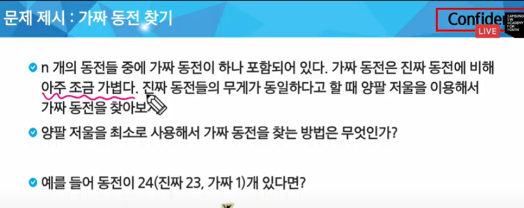
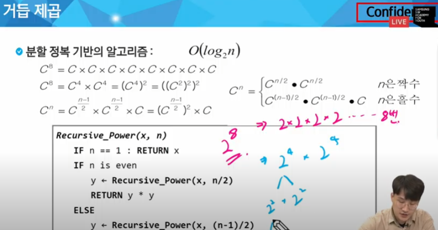
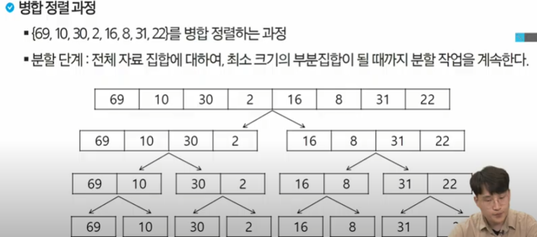
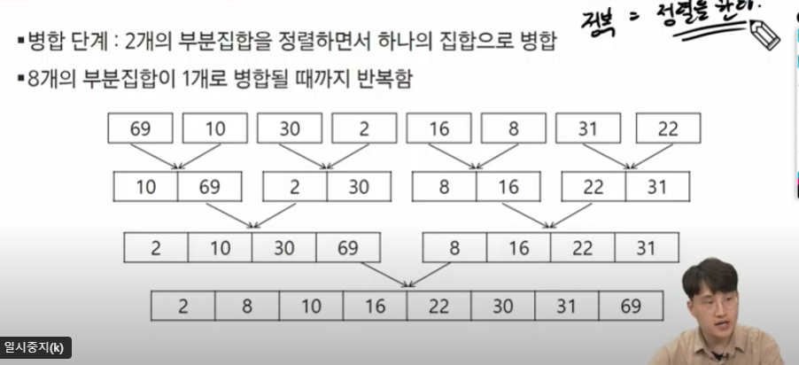
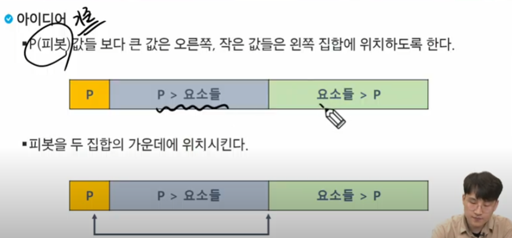
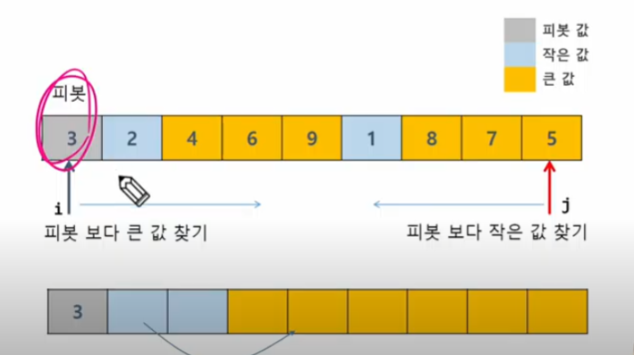
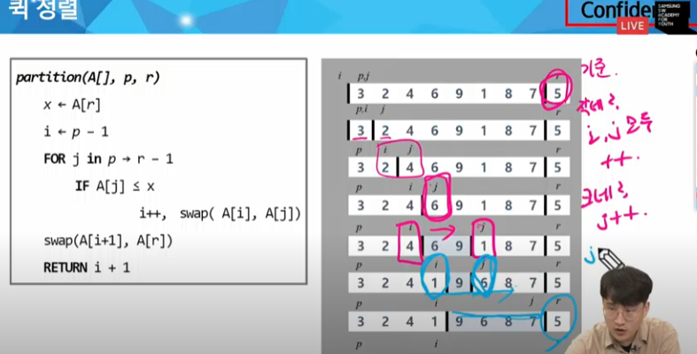
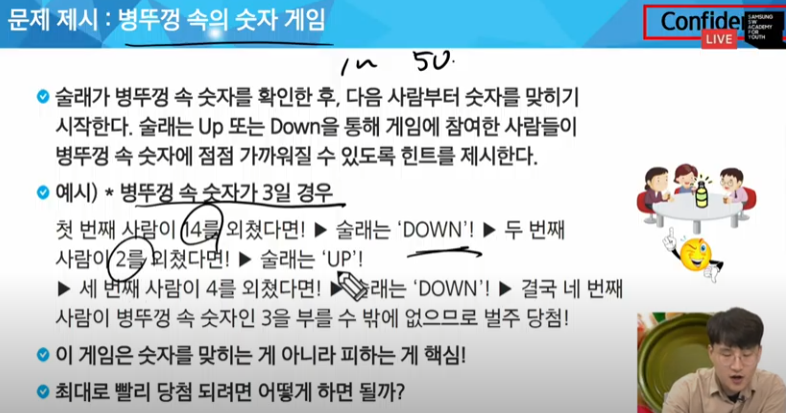

# 0918 온라인 수업 내용

### 알고리즘 설계 기법의 종류

1. Brute Force (완전 탐색) :
    - 전체를 다 보자
    - 배열 : 반복문을 다 돌리기
    - 그래프 : DFS , BFS
2. Greedy (탐욕) :
    - 상황마다 좋은 것을 고르자
    - 규칙을 찾는 것
    - 주의사항 : 
        - 항상 좋은 것을 뽑아도, 최종결과가 제일 좋다
3. Dynamic Programming :
    - 하나의 큰 문제를 작은 문제로 나눠 부분적으로 해결하자
    - Memoization 기법을 활용
    - 점화식 (Bottom-up) , 재귀 (Top-Down)
4. Divide and Conqure (분할 정복)
    - 큰 문제를 작은 문제로 쪼개어 해결하자
5. Backtracking (백트래킹)
    - 전체 중, 가능성 없는 것을 빼고 보자
    - 가지 치기

## 분할 정복

1. 병합 정렬
2. 퀵 정렬
3. 이진탐색

### 예시 문제 (가짜 동전 찾기)

24개의 동전 -> 12개 12개로 나눠서 보기 -> 6/6 -> 3/3 -> 1/1 
- 분할(Divide)
    - 해결할 문제를 여러 개의 작은 부분으로 나눈다
- 정복(Conquer)
    - 나눈 작은 문제의 해결
- 통합(Combine)

### 거듭제곱


    Recursive_Power(x,n)
        if n == 1: Return x
        if n is even
            t <- Recursive_Power(x, n/2)
            retrun y * y
        else
            y <- Recursive_Power(x, (n-1)/2)
            return y * y * x

## 1. 병합 정렬
- 여러 개의 정렬된 자료의 집합을 병합하여 한 개의 정렬된 집합으로 만드는 방식 

- 자료를 최소 단위의 문제까지 나눈 후에 차례대로 정렬하여 최종 결과를 얻어냄
- top-down 방식

- 시간 복잡도
    - O (n log n)




- 재귀를 이용해서 구현

```
merge_sort(LIST m)
    IF length(m) == 1: RETURN m

    LIST left, right
    middle <- length(m)/2
    FOR x in m before middle
        add x to left
    FOR x in m after of equal middle
        add x to right

    left <-merge_sort(left)
    right <- merge_sort(right)

    RETURN merge(left,right
    )
```
```
merge(LIST left, LIST right)
    LIST result
    
    WHILE length(left) > 0 or length(right) > 0
        IF length(left) > 0 AND length(right) > 0
            IF first(left) <= first(rigth)
                append popfirst(left) to result
            ELSE
                append popfirst(right) to result
        ELIF lengt(left) > 0
            append popfirst(left) to result
        ELIF lenght(right) > 0
            append popfirst(rigth) to result
    RETURN result
        
```

## 2. 퀵 정렬
- 주어진 배열을 두 개로 분할하고, 각각을 정렬한다.

- 다른 점1 : 병합 정렬은 두 부분으로 나누는 반면에 , 퀵 정렬은 분할 할 때, 기준 아이템 (pivot item)을 중심으로, 이보다 작은 것은 왼편, 큰 것은 오른편에 위치 시킨다
- 다른 점2 : 각 부분 정렬이 끝난 후, 병합 정렬은 '병합'이라는 후처리 작업이 필요하나, 퀵 정렬은 필요하지 않음


- P(피봇) 값들 보다 큰 값은 오른쪽, 작은 값들은 왼쪽 집합에 위치하도록 함


```
partition(A[],p,r)
    x <- A[r]
    i <- p - 1

    FOR j in p -> r - 1
        IF A[j] <= x
            i++ , swap(A[i],A[j])

    swap(A[i+1],A[r])
    RETURN i + 1
```


- 병합 정렬 
    - 직접 구현할 일은 적다
    - 과거에 면접 단골 질문 + 분할 정복 학습에 좋다
- 퀵 정렬
    - 직접 구현할 일은 적다
    - 과거에 면접 단골 질문

## 3. 이진 검색


- 검색과정

1. 자료의 중앙에 있는 원소를 고른다.
2. 중앙 원소의 값과 찾고자 하는 목표 값을 비교한다.
3. 목표값이 중앙 원소의 값보다 작으면, 자료의 왼쪽 반에 대해서 새로 검색을 수행하고, 크다면 자료의 오른쪽 반에 대해서 새로 검색을 수행한다.
4. 찾고자 하는 값을 찾을때까지 1-3의 과정을 반복

```
BinarySearch(n,S[],key)
low <- 0
high <- n - 1

WHILE low <= high
    mid <- low + (high -low) / 2

    IF S[mid] == key
        RETURN  mid
    ELIF S[mid] > key
        high <- mid - 1
    ELSE 
        low <- mid + 1

RETURN -1

```

```
# 이진 검색 - 재귀 호출


```

***
# 0918 오프라인 실습

- 분할 함수(재귀) + 병합 함수

### 분할 함수

```
# 분할 함수
def divide(arr):
    if len(arr) <= 1: # 리스트의 길이가 1이하이면 그대로 반환
        return arr

    middle = len(arr) // 2
    left = divide(arr[:middle])
    right = divide(arr[middle:])
    return merge(left,right) # 나눈 두 부분을 병합

```

### 병합 함수
```
# 병합 함수
def merge(left,right):
    global ans
    if right[-1] < left[-1]:
        ans += 1

    result = []
    len_l = len(left)
    len_r = len(right)
    l = r = 0
    while l < len_l or r < len_r:
        # 1. 왼쪽과 오른쪽 리스트 모두 남아있는 경우
        if l < len_l and r < len_r:
            if left[l] <= right[r]:
                result.append(left[l])
                l += 1
            else:
                result.append(right[r]) # 오른쪽의 원소를 result 에 추가
                r += 1

        # 2. 오른쪽 리스트만 남아있는 경우
        elif l < len_l:
            result.append(left[l])
            l += 1
        # 3. 왼쪽 리스트만 남아있는 경우
        elif r < len_r:
            result.append(right[r])
            r += 1
    return result

T = int(input())
for tc in range(1,T+1):
    N = int(input())
    arr = list(map(int,input().split()))
    ans = 0
    result = divide(arr)
    print(f'#{tc} {result[N//2]} {ans}')
    
```