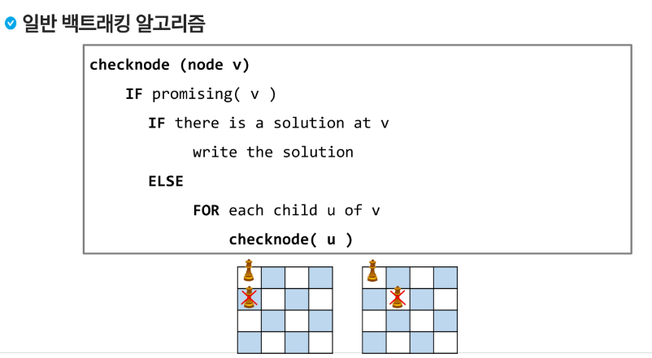
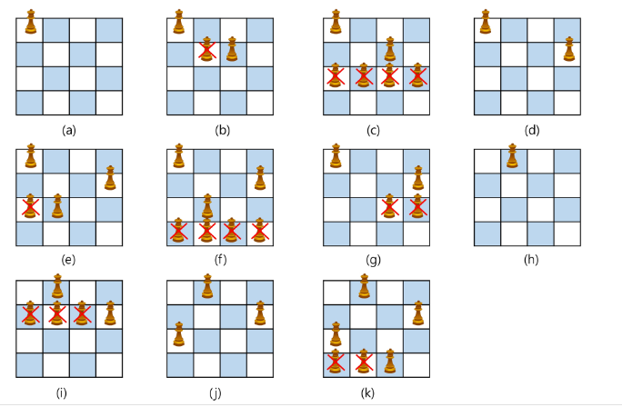
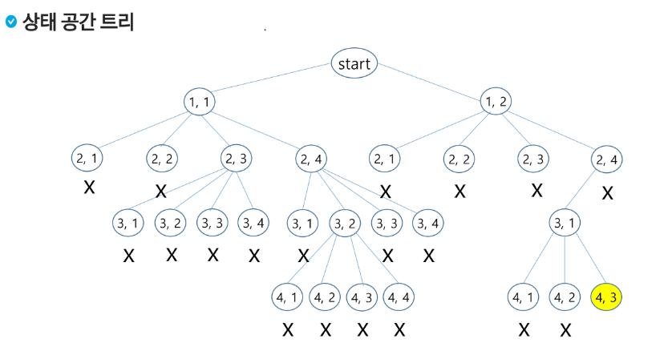
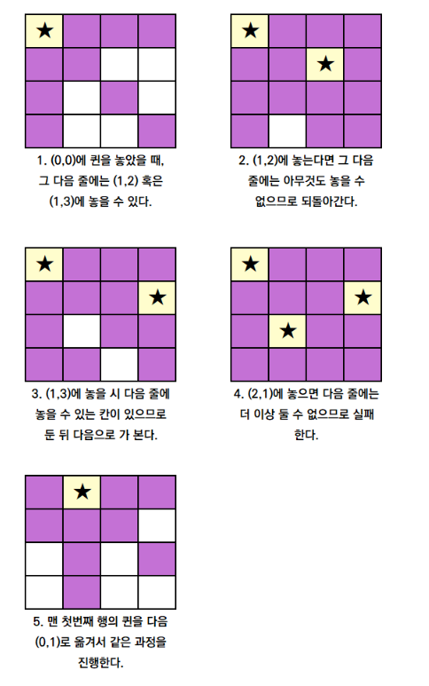
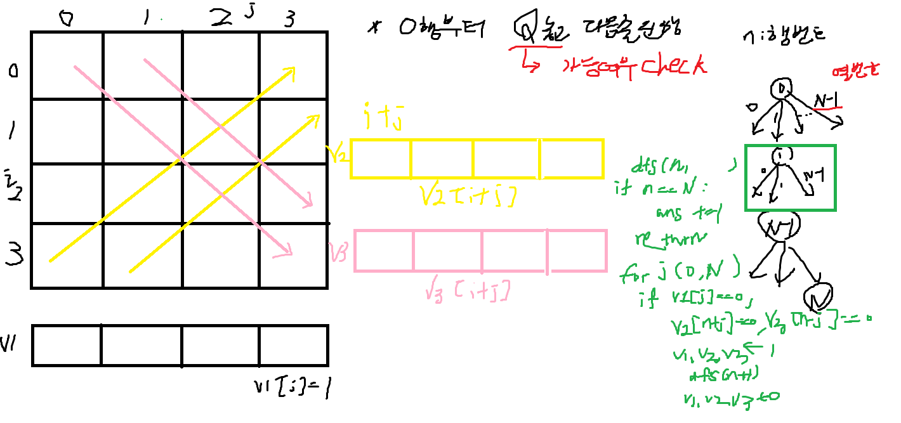

# 0919 온라인 실습

#### INDEX
```
백트래킹
    - 정의
    - N -Queen
    - SWEA 문제
```

- 정의 :
    - 여러가지 선택지들이 존재하는 상황에서 한가지를 선택한다.
    - 선택이 이뤄지면 새로운 선택지들의 집합이 생성된다.
    - 이런 선택을 반복하면서, 최종 상태에 도달한다.
        - 올바른 선택을 계속하면 목표상태 (goal state)에 도달하게 된다.

#### 백트래킹과 깊이 우선 탐색의 차이
- 어떤 노드에서 출발하는 경로가 해결책으로 이어질 것 같지 않으면, 더 이상 그 경로를 따라가지 않음으로써 시도의 횟수를 줄인다. (<em>Prunning</em> 가지치기)

- 깊이 우선 탐색이 모든 경로를 추적하는데에 비해 백트래킹은 불필요한 경로를 조기에 차단한다.

- 깊이 우선 탐색을 하기에는 경우의 수가 너무 많을 경우 --N! 가지의 경우의 수를 가진 문제에 대해서 깊이 우선 탐색을 가하면 처리 불가한 문제 

- 백트래킹 알고리즘을 적용하면 일반적으로는 경우의 수가 줄어들지만, 이 역시 최악의 경우에는 여전히 지수시간을 요하므로 처리가 불가하다.

### 백트래킹의 순서
1. 상태 공간 트리의 깊이 우선 검색을 실시한다.
2. 각 노드가 유망한지를 점검한다.
3. 만일 그 노드가 유망하지 않으면, 그 노드의 부모 노드로 돌아가서 검색을 계속한다.

#### N - QUEEN 문제




- 설명




- 백트래킹 관련 용어

```
- Promising : 해당 루트가 조건에 맞는지 검사하는 기법
- Pruning (가지 치기) : 조건에 맞지 않으면 포기하고, 다른 루트로 바로 돌아서서 탐색의 시간을 절약
```



- 코드 구현
```
T = int(input())

def dfs(n):
    global ans
    if n == N:
        ans += 1
        return
    for j in range(N):
        if v1[j] == v2[n+j] == v3[n-j] == 0:
            v1[j] = v2[n+j] = v3[n-j] = 1
            dfs(n+1)
            v1[j] = v2[n+j] = v3[n-j] = 0

for tc in range(1,T+1):
    N = int(input())
    ans = 0

    v1,v2,v3 = [[0]*(2*N) for _ in range(3)]
    dfs(0)
    print(f'#{tc} {ans}')

```