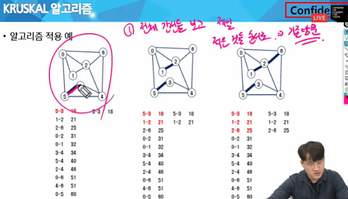

# 0921 온라인 실습

#### INDEX
```
- 최소 비용 신장 트리(MST)
- 최단 경로
```

- 최소 신장 트리(MST)
    - 그래프에서 최소 비용 문제
        - 1. 모든 정점을 연결하는 간선들의 가중치의 합이 최소가 되는 트리
        - 2. 두 정점 사이의 최소 비용의 경로 찾기
    - 신장 트리
        - N개의 정점으로 이루어진 무방향 그래프에서 N개의 정점과 N-1 개의 간선으로 이루어진 트리
    - 최소 신장 트리 (Minimum Spanning Tree)
        - 무방향 가중치 그래프에서 신장 트리를 구성하는 간선들의 가중치의 합이 최소인 신장 트리

- MST 표현(1)

- MST 표현(2)


- Prim 알고리즘
    - 하나의 정점에서 연결된 간선들 중에 하나씩 선택하면서 MST를 만들어 가는 방식
        - 1. 임의 정점을 하나 선택해서 시작
        - 2. 선택한 정점과 인접하는 정점들 중의 최소 비용의 간선이 존재하는 정점을 선택
        - 3. 모든 정점이 선택될 때까지 1,2의 과정을 반복

    - 서로소인 2개의 집합(2 disjoint-sets) 정보를 유지
        - 트리 정점들 (tree verticles) - MST를 만들기 위해 선택된 정점들
        - 비트리 정점들 (nontree verticles) - 선택되지 않은 정점들 


- 알고리즘 구현
```
import heapq

def prim(start):
    heap = []
    # MST 에 포함되었는지 여부
    MST = [0] * V

    # 가중치, 정점 정보
    heapq.heappush(heap,(0, start))

    while heap:
        # 가장 적은 가중치를 가진 정점을 꺼냄
        weight, v = heapq.heappop(heap)

        # 갈 수 있는 노드라면 pass
        if MST[v]:
            continue
        # 방문 체크
        MST[v] = 1

        # 갈 수 있는 노드들을 체크
        for next in range(V):
            # 갈 수 없거나 이미 방문했다면 pass
            if graph[v][next] == 0 or MST[next]:
                continue

            heapq.heappush(heap, (graph[v][next], next))

prim(0)
V, E = map(int,input().split())

graph = [[0] * V for _ in range(V)]

for _ in range(E):
    f,t,w = map(int,input().split())
    graph[f][t] = w
    graph[t][f] = w


```

- KRUSKAL 알고리즘



```
# KRUSKAL 알고리즘


# 모든 간선들 중 비용이 가장 적은 걸 우선으로 고르자
V, E = map(int,input().split())
edge = []
for _ in range(E):
    f,t,w = map(int,input().split())
    edge.append([f,t,w])

# w를 기준으로 정렬
edge.sort(key=lambda x:x[2])

# 사이클 발생 여부를 union find로 해결
parents = [i for i in range(V)]

def find_set(x):
    if parents[x] == x:
        return x
    
    parents[x] = find_set(parents[x])
    return parents[x]


def union(x,y):
    x = find_set(x)
    y = find_set(y)

    if x == y:
        print('사이클 발생')
        return
    
    if x < y:
        parents[y] = x
    else:
        parents[x] = y

cnt = 0
sum_weight = 0
for f,t,w in edge:
    # 사이클이 발생하지 않는다면
    if find_set(f) != find_set(t):
        cnt += 1
        union(f,t)
        # MST 구성이 끝나면
        if cnt == V:
            break
print(f'최소 비용 = {sum_weight}')

```

- 최단 경로 정의
    - 간선의 가중치가 있는 그래프에서 두 정점 사이의 경로들 중에 간선의 가중치의 합이 최소인 경로

- 하나의 시작 정저에서 끝 정점까지의 최단 경로
    - 다익스트라(dijkstra) 알고리즘

#### 다익스트라(DIJKSTRA) 알고리즘

    - 시작 정점에서 거리가 최소인 정점을 선택해 나가면서 최단경로를 구하는 방식

    - 시작 정점(s)에서 끝정점(t) 까지의 최단경로에 정점 x가 존재한다.
    - 이때, 최단경로는 s에서 x까지의 최단경로와 x에서 t까지의 최단경로 구성된다.
    - 탐욕 기법을 사용한 알고리즘으로 MST의 프림 알고리즘과 유사하다.


```
# 다익스트라 알고리즘

# 내가 갈 수 있는 경로 중 누적거리가 제일 짧은 것부터 고르자
import heapq


# 입력
n, m = map(int,input().split())
# 인접리스트
graph = [[] for i in range(n)]
for _ in range(m):
    f, t, w = map(int,input().split())
    graph[f].append([t,w])


# 1. 누적 거리를 계속 저장
INF = int(1e9)  # 최대값으로 1억 
distance = [INF] * n

start = 0

def dijkstra(start):
    # 2. 우선 순위 큐
    pq = []
    heapq.heappush(pq,(0,start))
    distance[start] = 0

    while pq:
        # 현재 시점에서
        # 누적 거리가 가장 짧은 노드에 대한 정보 꺼내기
        dist, now = heapq.heappop(pq)

        # 이미 방문한 지점 +  누적 거리가 더 짧게 방문한 적이 있다면 pass
        if distance[now] < dist:
            continue

        # 인접 노드를 확인
        for next in graph[now]:
            next_node = next[0]
            cost = next[1]

            # next_node 로 가기 위한 누적 거리
            new_cost = dist + cost

            # 누적 거리가 기존 보다 크네?
            if distance[next_node] <= new_cost:
                continue

            distance[next_node] = new_cost
            heapq.heappush(pq, (new_cost,next_node))

dijkstra(0)
print(distance)

```


### 최단거리 문제 유형
- 1. 특정 지점 -> 도착 지점까지의 최단 거리 :  다익스트라
- 2. 가중치에 음수가 포함되어 있네 ? : 벨만포드
- 3. 여러 지점 -> 여러 지점까지의 최단 거리
        - 여러 지점 모두 다익스트라 돌리기 -> 시간 복잡도 계산 잘해야함
        - 플로이드 - 워샬


# 0921 오프라인 실습

- DFS, BFS 공통점 : 그래프나 트리의 노드들을 탐색하는 방법론
- BFS : 가까운 노드(레벨)부터 , DFS는 깊이를 우선시하여 탐색

- UNION-FIND는 그래프의 노드들을 집합으로 관리 
두 노드가 같은 집합에 속하는지 OR
두 집합을 하나로 합치는 연산을 효율적으로 수행하는데 사용

- DIJKSTRA : 가중치 있는 그래프에서 한 노드로부터 다른 모든 노드까지의 최단거리를 찾는다.


- UNION-FIND :
    - 개념 : * DisJoint Set 를 표현할 때 사용하는 알고리즘
        ```
        DisJoint Set : 
            서로 중복 되지 않는 부분 집합들로 나눠진 원소들에 대한 정보를 저장하고 조작하는 자료 구조

            - 공통 원소가 없는, '상호배타적'인 부분 집합들로 나눠진 원소들에 대한 자료 구조이다
            - DisJoint Set : 서로소 집합 자료 구조
        
        ```
        - 집합을 구현하는데 비트 벡터, 배열 , 연결 리스트를 이용할 수 있으나, 그 중 가장 효율적인 트리 구조를 사용하여서 구현함
        - 아래의 세가지 연산을 통해 DisJoint Set를 표현

### UNION FIND 연산
- make-set(x)
    - 초기화
    - x를 유일한 원소로 하는 새로운 집합을 만든다
- union(x,y)
    - 합하기
    - x가 속한 집합과 y가 속한 집합을 합친다. 즉, x와 y가 속한 두 집합을 합치는 연산
- find(x)
    - 찾기
    - x가 속한 집합의 대표값(루트 노드 값)을 반환한다. 즉, x가 어떤 집합에 속해 있는지 찾는 연산

***
참고 : 
- 1. 배열 :
    - Array[i] : i번 원소가 속하는 집합의 번호(루트 노드의 번호)
    - make-set(x) :
        - Array[i] = i와 같이 각자 다른 집합 번호로 초기화한다.
    - union(x,y) :
        - 배열의 모든 원소를 순회하면서 y의 집합 번호를 x의 집합 번호로 변경한다.
        - 시간복잡도 : O(N)
    - find(x) :
        - 한 번만에 x가 속한 집합 번호를 찾는다.
        - 시간 복잡도 : O(1)

- 2. 트리 :
    - 같은 집합 = 하나의 트리, 즉 집합 번호 = 루트 노드
    - make-set(x):
        - 각 노드는 모두 루트 노드이므로 N개의 루트 노드 생성 및 자기자신으로 초기화한다
    - union(x,y) : 
        - x,y 의 루트 노드를 찾고 다르면 y를 x의 자손으로 넣어 두 트리를 합한다.
        - 시간복잡도 : O(N) 보다 작으므로 find 연산이 전체 수행 시간을 지배한다.
        ```
        def union(a, b):
	        a = find(a)
	        b = find(b)

	        parent[b] = a
        
        ```
    - find(x) : 
        - 노드의 집합 번호는 루트 노드이므로, 루트 노드를 확인하여 같은 집합인지 확인. 
        - 시간복잡도 : 트리의 높이와 시간복잡도가 동일 (최악 : O(N-1))
        ```
        def find(x):
	        if x == parent[x]:
		        return x
	
	        return find(parent[x])
        ```


[유니온파인드 블로그 설명글](https://yoongrammer.tistory.com/102)