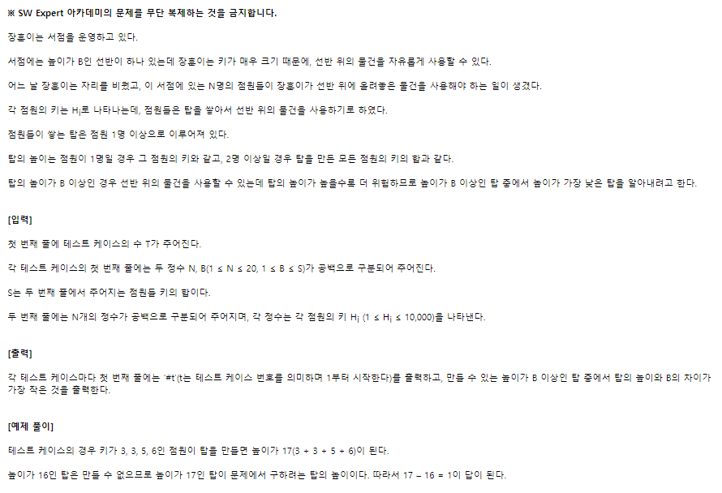
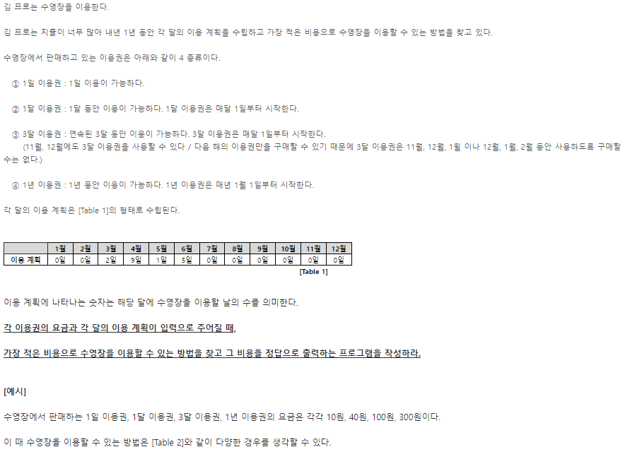
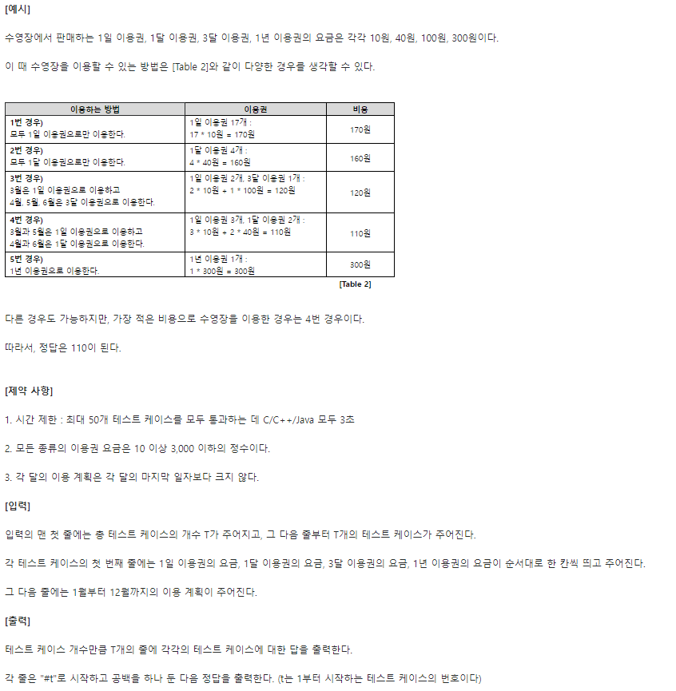
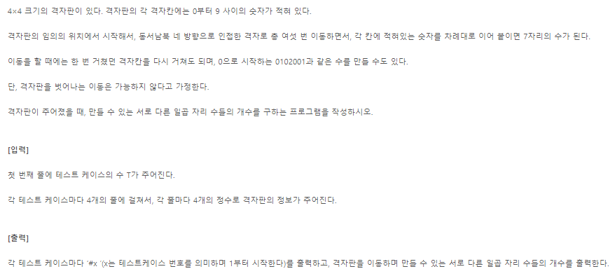
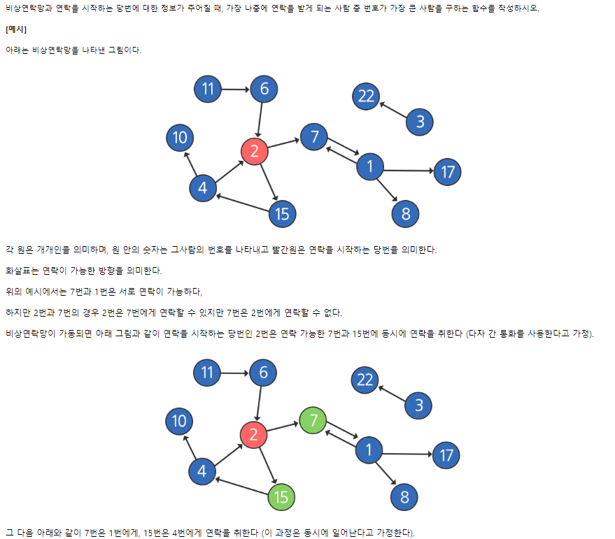
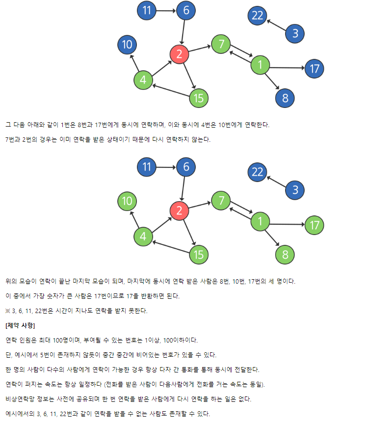

# 0922 온라인 실습

#### INDEX

```
문제풀이
- 1486. 장훈이의 높은 선반
- 1952. [모의 sw 역량 테스트] 수영장
- 2819. 격자판의 숫자 이어붙이기
- 1238. [sw 문제해결 기본] 10일차 - contact
```

#### 문풀1. 1486 . 장훈이의 높은 선반


```
1. 문제 해석
- 문제에서 원하는 목표
    -> 명확하게 문제를 파악
    --------------예시

- 서점
    - 높이가 B인 선반
    - 선반
        - 키가 큰 장훈이는 물건을 자유롭게 이용할 수 있다
    - 점원 (키 Hj)
        - 선반의 물건을 사용하기 위해 탑을 쌓는다.
        - 탑을 쌓는 방법
            - 1명 : 점원의 키 == 탑의 높이
            - 2명 이상 : 점원 키의 합 == 탑의 높이
            -> 선반보다 높거나 같을 경우 물건을 쓸 수 있다.
        - 높이가 B이상인 탑 중에서, 높이가 가장 낮은 탑을 구해라
    ----------------------문제 해석 완

2. 무슨 알고리즘을 쓸까?

시뮬레이션을 해보니 미리 무언가를 구할 수가 없다.
-> 모든 경우의 수를 보아야한다.
-> 1. 완전 탐색 문제이다 라고 생각하고 접근

- 먼저 떠오르는 알고리즘이 있다면, 시간을 먼저 계산

-> 이문제는 완전탐색으로 풀면 0(20!)
    -> 시간초과가 남

-> Backtracking
(N값이 20-30이면)
```
#### 문풀2. 1952. [모의 sw 역량 테스트] 수영장



```
1. 완전 탐색 접근
2. 가지치기 (Backtracking 발견)
    - 트리 구조로 생각할 순 없는가?

```

#### 문풀3. 2819. 격자판의 숫자 이어붙이기



```
- 격자판
 -> 이차원 배열
 -> 각 격자판 : 0 ~ 9 숫자

현재 지점 + 6번 이동하면서 숫자를 붙임
    -> 이동 : 네 방향(델타)

격자칸을 다시 가도 된다.
    -> visited 안 써도 된다.

0 시작 : 0102001
    -> 숫자가 0으로 시작 가능
    -> 문자열로 해결하면 편하겠다

요구하는 조건:
- 서로 다른 일곱 자리 수들의 개수
-> 가지치기 불가능
-> 무조건 일곱 자리 수를 다 붙여봐야 함
-> 완전 탐색을 해야함


- 서로 다른 일곱 자리 수들의 개수
-> 중복을 제거할 방법?
-> SET 자료 구조

1. 재귀 돌리면서
2. 숫자가 7자리가 되면
3. set에다 넣는다.
```

#### 문풀4. 1238. [sw 문제해결 기본] 10일차 - contact

- 복습 ㄱㄱ






***

```
강사님의 꿀팁

0. IDE를 적극적으로 활용해라
    - input.in 써서, 복사하지 말고 사용
    - 디버깅 툴 -> 적극적으로 써라
        -> print로 다 디버깅 해야함
        -> 적재적소에 print를 사용할 줄 알아야함
        -> 디버깅 툴을 활용해서 연습

1. 문제를 봤을 때, 원하는 알고리즘을 선택
1-1. 일단 완전 탐색으로 생각해봐라
    -> N값을 반드시 확인해서, 시간 복잡도 확인
1-2. Backtracking 하는 방법 생각 (n이 대략 20-30일때 ㄱㅊ)
1-3. 조금 더 어려운 알고리즘 (n이 100넘어가고 이러면)
    - 그리디 (규칙 찾기)
    - DP (두 번 계산하지 않기)
    - UNION-FIND
```