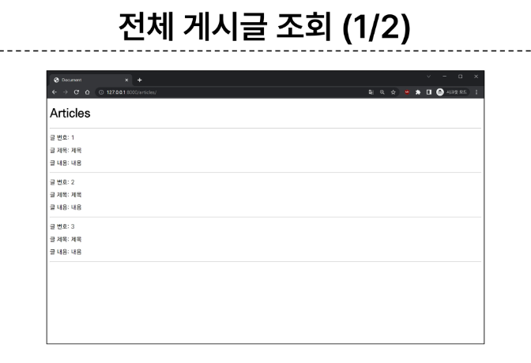
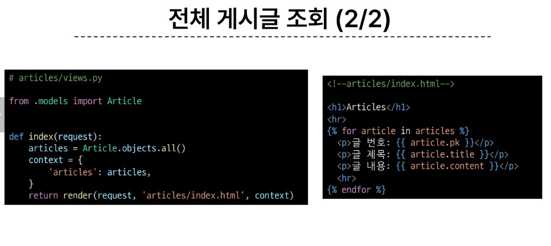
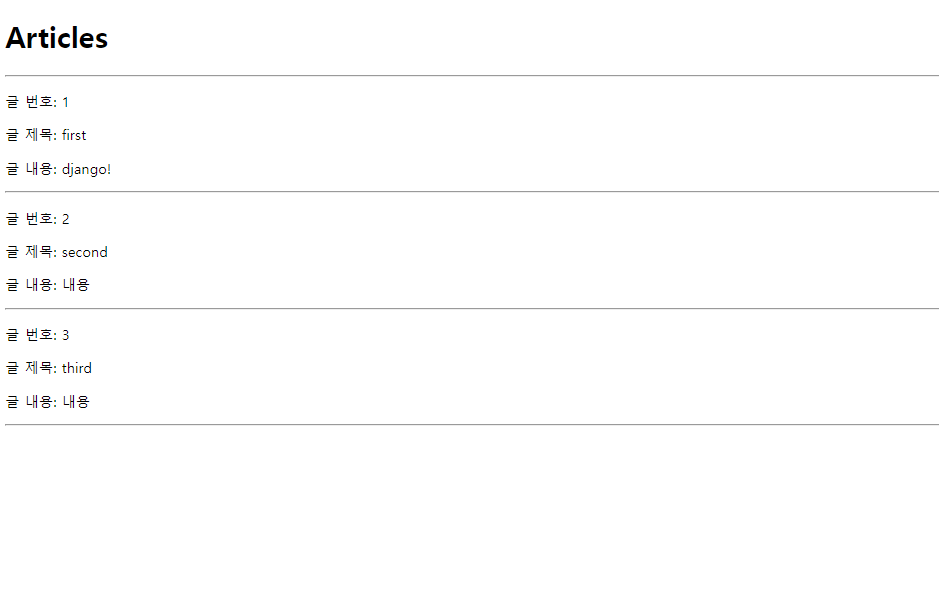
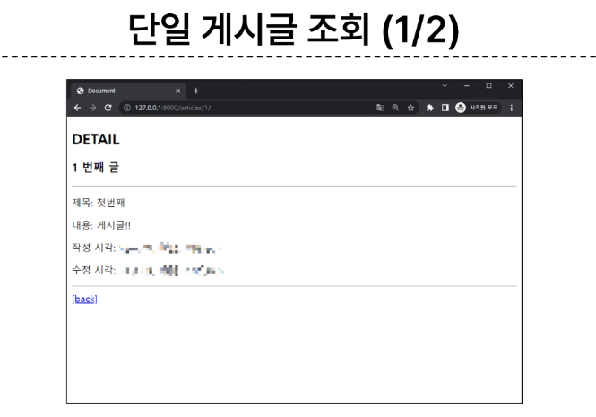
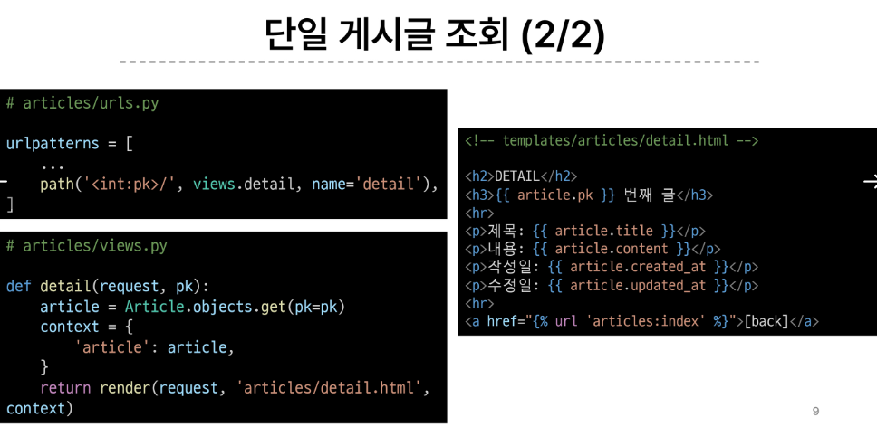

# 0925 온라인 수업

- ### Django ORM with view
#### INDEX

```
1. Read
2. Create
3. HTTP request methods
4. Delete
5. Update
```

## 1. Read

```
1. 전체 게시글 조회
2. 단일 게시글 조회
```

#### 1-1. 전체 게시글 조회



- cf ) 일단은 모델을 만들고, migration해서 article에 Article 정보 담아두고,
shell_plus 에서 정보를 db에 저장


#### 1-2. 단일 게시글 조회

