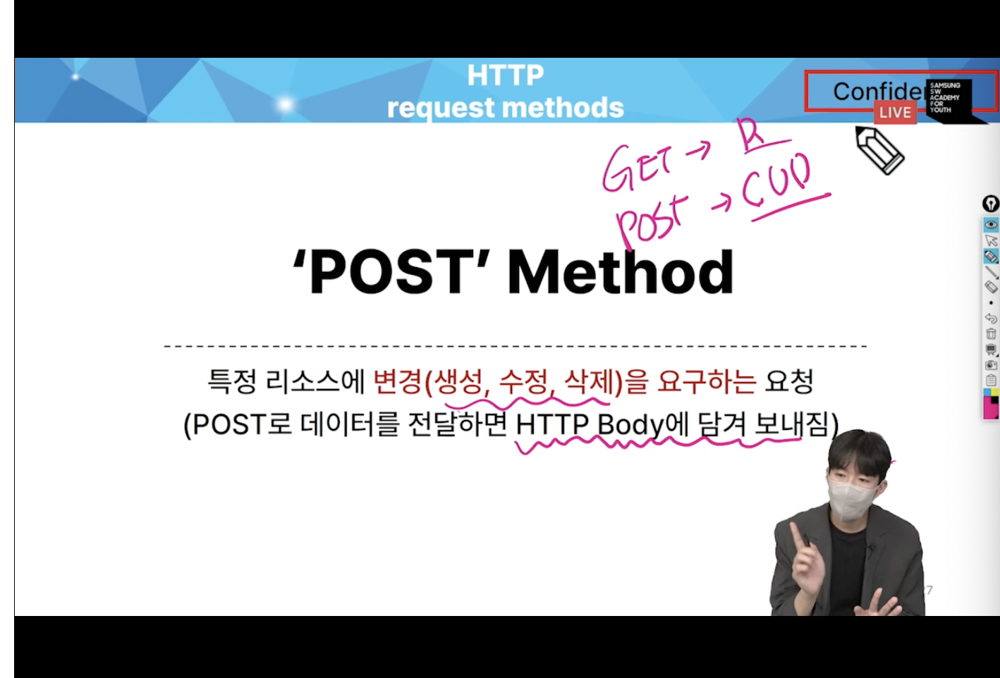

# 0925 온라인 실습

#### INDEX
```
1. READ
2. CREATE
3. HTTP request methods
4. DELETE
5. UPDATE
```

### 1. Read


1. 전체 게시글 조회

-> 모델.objects.all()에 쿼리를 담고 articles에 전달

-> admin 에 모델에서 등록한 article을 등록 해야함

2. 단일 게시글 조회


```
-> urls.py에 
<int:pk>로 지정해주고, detail url 작성
-> views.py 에 detail 함수 지정 모델.objects.get() -> 1개만 있을 때 유일한 식별자인 pk값으로 지정

```

***
NoReverseMatch : url을 보자


### 2. Create

- Create 로직을 위해서 필요한 view 함수 의 개수?
- throw /catch


- 1. new 함수 :

사용자 입력 페이지만 보여주면 됨
form -> input 태그에 작성되는 것을 보내는 함수


- 기본적인 html문법 : label 이나 input 태그

- 제출을 위해서 create 함수 필요

- 2. Create 함수:
    - DB 에 게시글을 저장

    - 게시글 저장 방법 3
    ```
    1. 인스턴스를 만든 후 , 하나하나 데이터를 넣는 방법

    article = Article()
    article.title = request.GET.get('name값')
    article.content = request.GET.get('content')
    article.save()

    2. 초기값으로 인스턴스를 만드는 방법
    article = Article(title=title, content=content)
    article.save()

    3. create 메소드
    Article.object.create(title=title, content=content)
    ```

    - 2번째 방법을 쓸 것임
    - 저장 되기 전에 유효성 검사 진행

- create 함수의 최종 목적은 save
- render : 템플릿을 우리에게 준다
- redirect : 다시 요청하다. 다시 지시한다.
    - 게시글이 작성이 되고, 메인페이지로 다시 요청을 보내기 위해서 redirect 를 씀
    - 요청이 두 개가 감
        - 글 쓰는 요청
        - 내가 볼 다른 페이지로 갈 요청
- C, U, D 모두 redirect 가 필요함

### 3. HTTP request method
- HTTP
    - 네크워크 상에서 데이터를 주고 받기 위한 약속
- HTTP request methods
    - 데이터(리소스)에 어떤 요청(행동)을 원하는지를 나타내는 것
    - GET & POST
    - 1. GET:
        - 특정 리소스를 조회하는 요청
        (GET으로 데이터를 전달하면 query String 형식으로 보내짐)
        
    - 2. POST:
        - 특정 리소스에 변경(생성, 수정, 삭제)을 요구하는 요청
        (POST로 데이터를 전달하면 HTTP Body에 담겨 보내짐)
        - url에 노출되지 않음
        

- 따라서, 정보를 생성할 때는 POST 메소드를 이용해서 보내야함


- 403 에러: 접근 권한이 없다.
- CSRF token 이 없다

- HTTP response status code 
    - 특정 HTTP 요청이 성공적으로 완료되었는지를 3자리 숫자로 표현하기로 약속한 것
    - 400번대: 
        - 404: 당신이 요청한 페이지를 보낼 수 없다(클라이언트의 잘못)
    - 500번대: 서버의 잘못
    - 200번대: 성공

- CSRF:
    - Cross-Site-Request-Forgery :
    - 사이트 간 요청 위조
    - 사용자가 자신의 의지와 무관하게 공격자가 의도한 행동을 하여 특정 웹페이지를 보안에 취약하게 하거나 수정, 삭제등의 작업을 하게 만드는 공격 방법
    - POST 메소드 에서 해킹을 방지 하기 위해서 token을 심어야 함
- 쓰는 이유 : POST 는 DB 에 영향을 주기 때문에

### 4. REDIRECT

- 데이터 저장 후 다른 페이지로 사용자를 보내야한다.
- 사용자가 get 요청을 한번 더 보내도록

### 5. UPDATE

- update 로직을 구현하기 위해서 view함수는 몇개 필요할 까?


- create 와 유사하지만,
- 새로운 인스턴스를 만드는게 아닌, 기존 인스턴스를 찾고 그것을 갱신 시켜주는 점이 좀 다르다.

### 6. DELETE


- 수정과 마찬가지로, 삭제는 어떠한 게시글을 삭제할 건지 조회부터 해야함

- url도 int:pk로 먼저 지정을 함

- delete.html 에서 구현

