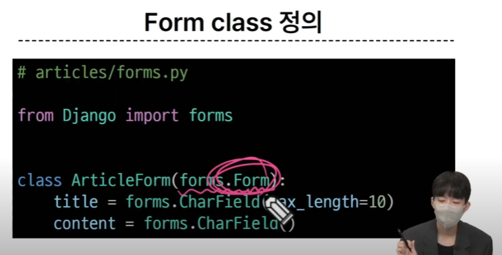

# 0926 온라인 수업

#### INDEX

```
1. 개요
2. Django Form
3. Django ModelForm
4. Handling HTTP requests
```

## 개요

- HTML 'form'
    - 지금까지 사용자로부터 데이터를 받기 위해 활용한 방법
    - 그러나 비정상적 혹은 악의적인 요청을 필터링 할 수는 없다 
        - 따라서 유효한 데이터인지에 대한 확인이 필요함
- 유효성 검사:
    - 수집한 데이터가 정확하고 유효한지 확인하는 과정

- 유효성 검사 구현
```
- 유효성 검사를 구현하기 위해 입력값, 형식, 중복, 범위, 보안 등 많은 것들을 고려해야함
- 이런 과정과 기능을 직접 개발하는 것이 아닌 Django 가 제공하는 Form 을 사용
```

## Django Form

- 사용자 입력 데이터를 수집하고, 처리 및 유효성 검사를 수행하기 위한 도구
    - -> 유효성 검사를 단순화하고 자동화 할 수 있는 기능 제공

