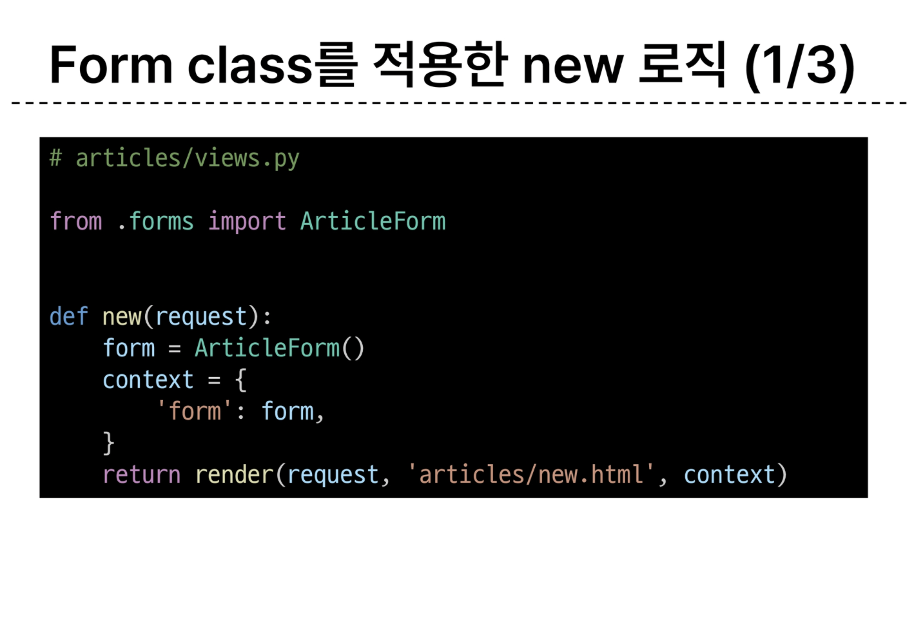
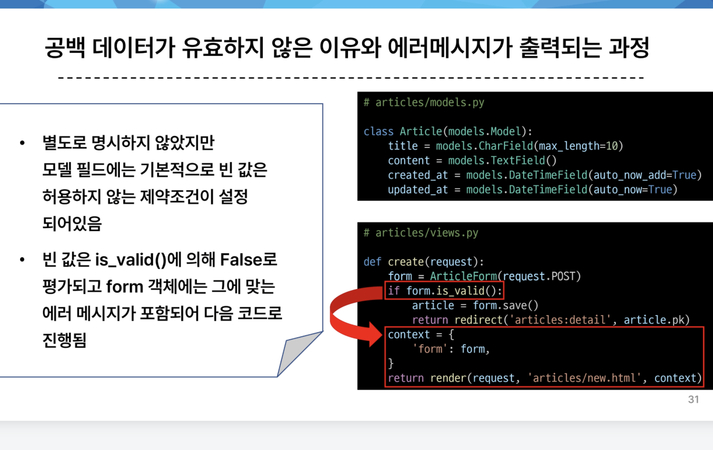

# 0926 온라인 실습


#### Django Form
#### INDEX
```
1. Django Form
2. Django ModelForm
3. Handling HTTP requests
```

- HTTP 'form'

    - 지금까지 사용자로부터 데이터를 받기 위해 활용하는 방법
    - 그러나 비정상적 혹은 악의적인 요청을 필터링 할 수 없음
    - 유효한 데이터인지에 대한 확인이 필요하다

- 유효성 검사
    - 많은 것들을 고려해야 하지만
    - Django가 제공하는 Form 을 사용한다.

### 1. Django Form

- 사용자 입력 데이터를 수집하고, 처리 및 유효성 검사를 수행하기 위한 도구
- 유효성 검사를 단순화하고 자동화 할 수 있는 기능을 제공한다.




- form 클래스를 views에서 가져옴
- ArticleForm()을 form 이라는 인스턴스로 전달


- {{form}} 으로 모든 title, content 태그를 대체

- {{form.as_p}}
    - label, input 쌍을 특정 html 태그로 감싸는 옵션

- widget

- widget 은 단순히 input요소의 속성 및 출력되는 부분을 변경하는 것

### 2. ModelForm

- form 과 기본적인 요소는 똑같지만, modelform은 model에서 정의되는것을 재정의 하지 않음

- model + form


- 사용자로 부터 입력받는 데이터가 DB에 저장이 되어야할 때, modelform을 씀


- modelform 문법
- model을 등록해놔야함
- fields 에 등록할 필드를 줌

- Meta class:
    - ModelForm의 정보를 작성하는 곳


- is_vaild()
    - 여러 유효성 검사를 실행하고, 데이터가 유효한지 여부를 boolean으로 반환



- 코드가 is_valid에 의해서 false로 평가되고, 에러메세지가 반환이 됨

- modelForm을 이용해서 edit 수정

- 이때 다른 점은 기존의 인스턴스를 가져오는 것인데 이거는 aritcleform('이안에') <- article을 넣어주면 됨


- update 는 create 와 비슷한 로직이지만, 똑같이 하면, 수정이 아니고 글을 생성한 것 같이 됨

- form.save()가 생성, 수정 둘 중 뭐일지 판단 해야함
form 안에 (request.POST, instance=article)
로 만들어야지
- 이것을 수정으로 인식함


- Django Form 정리
    - 사용자로부터 데이터를 수집하고 처리하기 위한 강력하고 유연한 도구
    - html form의 생성, 데이터 유효성 검사 및 처리를 쉽게 할 수 있도록 도움


### 3. Handling HTTP requests

- view 함수 구조 변화

- new & create view 함수 간 공통점과 차이점
    - 공통점 :
        - 목적이 같음(게시글 생성)
    - 차이점 :
        - new는 템플릿만(조회 -> GET)
        - create는 db에 저장
        (생성 -> POST)


- new 와 create 함수의 결합


- GET, POST 말고 다른 메소드가 존재 하기 때문에 POST 여부를 확인 후 if 문으로 보냄%

