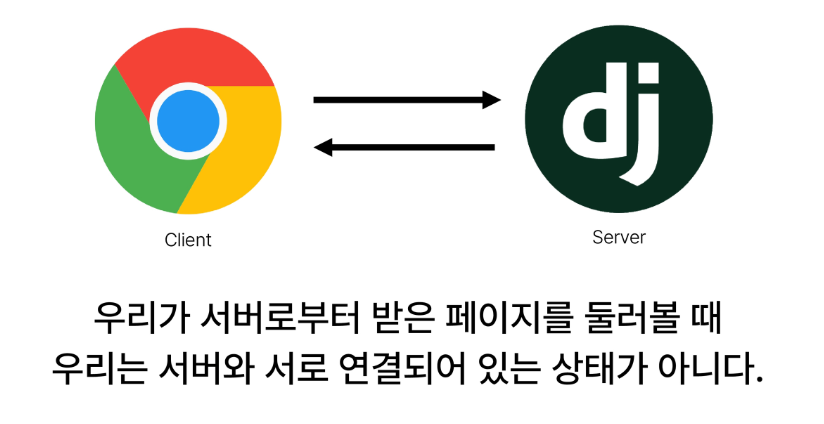

# 1004 온라인 실습


#### INDEX
```
1. Cookie & Session
2. Authentication System
3. Custom User model
4. Login
5. Logout
6. Template with Authentication
```



### 1. Cookie & Session 

- HTTP : 
    - HTML 문서와 같은 리소스들을 가져올 수 있도록 해주는 규약 
    - 웹(WWW)에서 이루어지는 모든 데이터 교한의 기초
- HTTP 특징
```
1. 비연결 지향(connectionless)
    - 서버는 요청에 대한 응답을 보낸 후 연결을 끊음
2. 무상태(stateless)
    - 연결을 끊은 순간 클라이언트와 서버 간의 통신이 끝나며 상태 정보가 유지 되지 않음
```
- Cookie
    - 서버가 사용자의 웹 브라우저에 전송하는 작은 데이터 조각
    - -> 클라이언트 측에서 저장되는 작은 데이터 파일이며, 사용자 인증, 추적, 상태 유지 등에 사용되는 데이터 저장 방식

- 쿠키 사용 원리
```
1. 브라우저(클라이언트)는 쿠키를 KEY-VALUE의 데이터 형식으로 저장
2. 이렇게 쿠키를 저장해 놓았다가, 동일한 서버에 재요청 시 저장된 쿠키를 함께 전송
- 쿠키는 두 요청이 동일한 브라우저에서 들어왔는지 아닌지를 판단할 때 주로 사용됨 
    - 이를 이용해서 사용자의 로그인 상태를 유지할 수 있음
    - 상태가 없는(STATELESS) HTTP 프로토콜에서 상태 정보를 기억 시켜 주기 때문
```
- 쿠키 사용 목적
```
1. 세션 관리(Session management)
    - 로그인, 아이디 자동완성, 공지 하루 안보기, 팝업 체크, 장바구니 등의 정보 관리
2. 개인화(Personalization)
    - 사용자 선호, 테마 등의 설정
3. 트래킹(Tracking)
    - 사용자 행동을 기록 및 분석
```

- 세션(Session)
    - 서버 측에서 생성되어 클라이언트와 서버 간의 상태를 유지
    - 상태 정보를 저장하는 데이터 저장 방식
    - 쿠키에 세션 데이터를 저장하여 매 요청시 마다 세션 데이터를 함께 보냄
- 세션 작동원리

    - 1. 클라이언트가 로그인을 하면 서버가 session 데이터를 생성 후 저장
    - 2. 생성된 session 데이터에 인증할 수 있는 session id 를 발급
    - 3. 발급한 session id 를 클라이언트에게 응답
    - 4. 클라이언트는 응답 받은 session id를 쿠키에 저장
    - 5. 클라이언트가 다시 동일한 서버에 접속하면 요청과 함께 쿠키(session id가 저장된)를 서버에 전달
    - 6. 쿠키는 요청 때 마다 서버에 함께 전송 되므로 서버에서 session id를 확인해 로그인 되어 있다는 것을 알도록 함

*** 
#### 참고
- 쿠키 종류별 lifetime(수명)
```
1. Session cookie
    - 현재 세션(current session)이 종료되면 삭제됨
    - 브라우저 종료와 함께 세션이 삭제됨
2. Persistent cookies
    - Expires 속성에 지정된 날짜 혹은 Max-Age 속성에 지정된 기간이 지나면 삭제됨
```


### 4. Login
- Session을 Create 하는 과정

- AuthenticationForm()
    - 로그인 인증에 사용할 데이터를 입력 받는 built-in form
