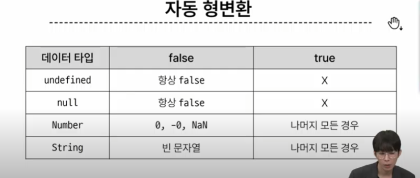
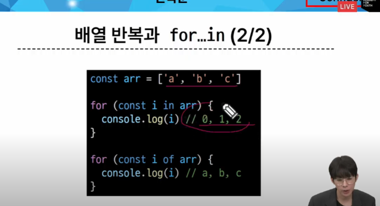
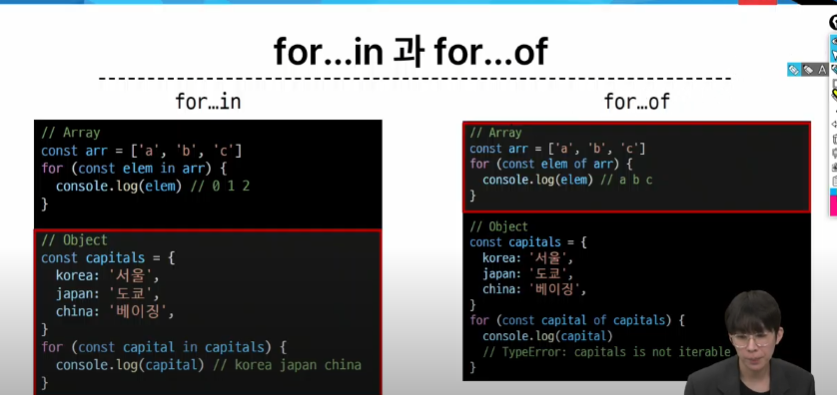
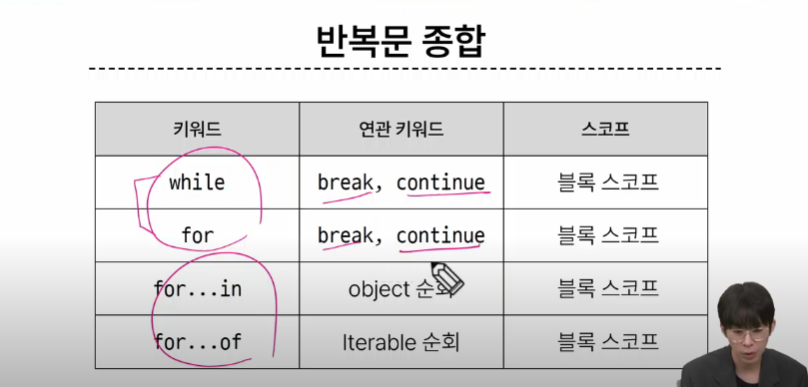

# 1024 온라인 실습

#### INDEX

```
1. 변수
2. 데이터 타입
3. 연산자
4. 조건문
5. 반복문
```

### 1. 변수

- 식별자(변수명) 작성 규칙
    - 반드시 문자, 달러($), 밑줄(_)로 시작
    - 대소문자 구분
    - 예약어 사용 불가
        - for, if , function
    - 카멜 케이스(camelCase)
        - 변수, 객체, 함수에 사용
    - 파스칼 케이스(PascalCase)
        - 클래스, 생성자에 사용
    - 대문자 스네이크 케이스(SNAKE_CASE)
        - 상수(constants)에 사용

- 변수 선언 키워드
    - 1. let
    - 2. const
    - 3. var

- 1. let
    - 블록 스코프(block scope)를 갖는 지역 변수를 선언
    - 재할당 가능
    - 재선언 불가능
    - ES6에서 추가

- 2. const
    - 블록 스코프를 갖는 지역 변수를 선언
    - 재할당 불가능
    - 재선언 불가능
    - ES6에서 추가


- 블록 스코프(block scope)
    - if, for, 함수 등의 '중괄호({}) 내부'를 가리킴
    - 블록 스코프를 가지는 변수는 블록 바깥에서 접근 불가능

- 변수 선언 키워드 정리
    - 기본적으로 const 사용을 권장
    - 재할당이 필요한 변수는 let으로 변경해서 사용


### 2. 데이터 타입

- 원시 자료형(Primitive type)
    - Number, String, Boolean, undefined, null
    - 변수에 값이 직접 저장되는 자료형(불변, 값이 복사)
    - 변수에 할당 될 때 값이 복사됨
        - 변수 간에 서로 영향을 미치지 않음
    ```
    const bar = 'bar'
    console.log(bar) // bar

    bar.toUpperCase()
    console.log(bar) // bar

    ------------------------
    let a = 10
    let b = a
    b = 20
    console.log(a) // 10
    console.log(b) // 20
    ```
- 참조 자료형(Reference type)
    - Objects (Object, Array, Function)
    - 객체의 주소가 저장되는 자료형(가변, 주소가 복사)
    - 객체를 생성하면 객체의 메모리 주소를 변수에 할당
        - 변수 간에 서로 영향을 미침
    ```
    const obj1 = {name = 'Alice', age: 30}
    const obj2 = obj1
    obj2.age = 40

    console.log(obj1.age) // 40
    console.log(obj2.age) // 40
    ```


- 원시 자료형
    - Number : 정수 또는 실수형 숫자를 표현하는 자료형
    ```
    const a = 13
    const b = -5
    const c = 3.14
    const d = 2.99e8
    const e = Infinity
    const f = -Infinity
    const g = NaN // Not a Number
    ```
    - String : 텍스트 데이터를 표현하는 자료형
        - '+' 연산자를 사용해 문자열끼리 결함
        - 곱셈, 나눗셈, 뺄셈 불가능
    ```
    const firstname = 'Tony'
    const lastName = 'Stark'
    const fullname = firstname  + lastName
    console.log(fullname)  // TonyStark
    ```

    - Template literals (템플릿 리터럴) 
        - 내장된 표현식을 허용하는 문자열 작성 방식
        - Backtick(``)을 이요하며, 여러줄에 걸쳐 문자열을 정의할 수 도 있고, 자바스크립트의 변수를 문자열 안에 바로 연결 할 수 있음
        - 표현식은 '$'와 중괄호(${expression})로 표기
        ```
        const age = 100
        const message = '홍길동은 ${age}세입니다'
        console.log(message) //홍길동은 100세입니다.
        ```

    - null 
        - 변수의 값이 없음을 의도적으로 표현할 때 사용

        ```
        let a = null
        console.log(a) // null
        ```
    - undefined
        - 변수 선언 이후 직접 값을 할당하지 않으면 자동으로 할당됨
        ```
        let b 
        console.log(b) // undefined
        ```

    - '값이 없음'에 대한 표현이 null 과 undefined 2개인 이유
        - 자바스크립트의 설계실수
        - 해결하지 못하는 이유는 이미 null 타입에 의존성을 띄고 있는 수많은 프로그램들이 망가질 수 있기 때문에

    - Boolean
        - true / false
        - 조건문 또는 반복문에서 Boolean이 아닌 데이터 타입은 "자동 형변환 규칙"에 따라 true 또는 false 로 변환됨

    


### 3. 연산자
- 할당 연산자
    - 오른쪽에 있는 피연산자의 평가 결과를 왼쪽 피연산자에 할당하는 연산자
    - 단축 연산자 지원
- 증가 & 감소 연산자
    - 증가 연산자 (++)
        - 피연산자를 증가(1을 더함)시키고 연산자의 위치에 따라 증가하기 전이나 후의 값을 반환
    - 감소 연산자 (--)
        - 피연산자를 감소(1을 뺌)시키고, 연산자의 위치에 따라 감소하기 전이나 후의 값을 반환
    - += 또는 -= 와 같이 더 명시적인 표현으로 작성하는 것을 권장
    ```
    let x = 3
    const y = x ++
    console.log(x,y) // 4 3

    let a = 3
    const b = ++a
    console.log(a,b) // 4 4
    ```

- 비교 연산자
    - 피연산자들(숫자, 문자, Boolean 등)을 비교하고 결과 값을 boolean으로 반환하는 연산자
    ```
    3 > 2 // true
    2 < 2 // false

    'A' < 'B' // true
    'Z' < 'a' // true
    '가' < '나' // true
    ```

- 동등 연산자
    - 두 피연산자가 같은 값으로 평가되는지 비교 후 boolean 값을 반환
    - '암묵적 타입 변환' 통해 타입을 일치시킨 후 같은 값인지 비교
    - 두 피연산자가 모두 객체일 경우 메모리의 같은 객체를 바라보는지 판별
    ```
    console.log(1 == 1) //true
    console.log('hello' == 'hello') // true
    console.log('1' == 1) // true
    console.log(0 == false ) // true

    ```
- 일치 연산자
    - 두 피연산자의 값과 타입이 모두 같은 경우 true를 반환
    - 같은 객체를 가리키거나 , 같은 타입이면서 같은 값인지를 비교
    - 엄격한 비교가 이뤄지며, 암묵적 타입 변환이 발생하지 않음
    - 특수한 경우를 제외하고는 동등 연산자가 아닌 일치 연산자 사용을 권장
    ```
    console.log( 1 === 1 ) // true
    console.log('hello' === 'hello') // true
    console.log('1' === 1 ) // false
    console.log( 0 === false ) // false
    ```

- 논리 연산자
    - and 연산
        - &&
    - or 연산
        - ||
    - not 연산
        - !
    - 단축 평가 지원

### 4. 조건문

- if
    - 조건 표현식의 결과값을 boolean 타입으로 변환 후 참/거짓을 판단

- 조건(삼항) 연산자
    - 세 개의 피연산자를 받는 유일한 연산자
    - 앞에서부터 조건문, 물음표(?), 조건문이 참일 경우 실행할 표현식, 콜론(;), 조건문이 거짓일 경우 실행할 표현식이 배치


### 5. 반복문
- WHILE
    - 조건문이 참이면 문장을 계속해서 수행

    ```
    let i = 0

    while(i < 6) {
        console.log(i)
        i += 1
    }
    ```
- FOR
    - 특정한 조건이 거짓을 판별될 때까지 반복
    ```
    for ([초기문]; [조건문]; [증감문]) {
        //
    }

    for (let i = 0; i < 6; i ++) {
        console.log(i)
    }
    // 0 1 2 3 4 5
    ```
    - for 동작 원리
        - 1. 반복문 진입 및 변수 i 선언
        - 2. 조건문 평가 후 코드 블럭 실행
        - 3. 코드 블록 실행 이후 i 값 증가
- FOR ... IN
    - 객체의 열거 가능한 속성(property)에 대해 반복
    ```
    for (variable in object) {
        statement
    }

    const fruits = {
        a : 'apple'
        b : 'banana'
    }

    for (const property in fruits) {
        console.log(property)
        console.log(fruits[property])
    }
    // a b
    // apple banana
    ```
- FOR ... OF
    - 반복 가능한 객체(배열, 문자열 등)에 대해 반복

    ```
    for (variable of iterable) {
        statement
    }

    const numbers = [0,1,2,3]
    
    for (const number of numbers) {
        console.log(number)
    }
    ```

- 배열 반복과 for ... in
    - 배열의 인덱스는 정수 이름을 가진 열거 가능한 속성
    - for..in 은 정수가 아닌 이름과 속성을 포함하여 열거 가능한 모든 속성을 반환
    - 내부적으로 for..in은 배열의 반복자 대신 속성 열거를 사용하기 때문에 특정 순서에 따라 인덱스를 반환하는 것을 보장할 수 없음

        - 인덱스의 순서가 중요한 배열에서는 사용하지 않음
        - 배열에서는 for 반복, for..of 반복을 사용



- 반복문 사용시 const 사용 여부
    - for 문
        - for (let i = 0; i < arr.length; i++) {...} 의 경우에는
        - 최초 정의한 i를 '재할당'하면서 사용하기 때문에 const를 사용하면 에러 발생
    - for...in, for...of
        - 재할당이 아니라, 매 반복 마다 다른 속성 이름이 변수에 지정되는 것이므로 const를 사용해도 에러가 발생하지 ㅇ낳음
        - 단, const 특징에 따라 블록 내부에서는 변수를 수정할 수 없음

- 반복문 종합



*** 
- 참고
- 세미콜론 
    - 자바스크립트는 세미콜론을 선택적으로 사용가능
    