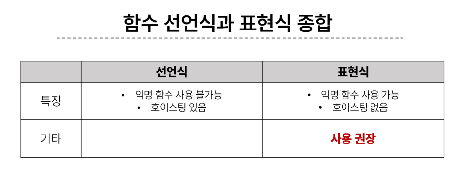
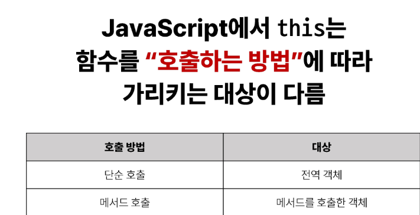
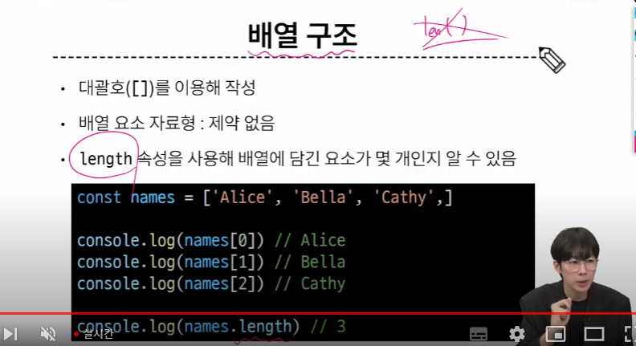
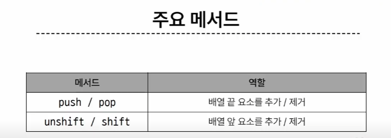

# 1025 온라인 실습

#### INDEX
```
1. 함수
2. 객체
3. 배열
```

### 1. 함수
- 원시 자료형(Primitive type)
    - Number, String, Boolean, undefined, null
    - 변수에 값이 직접 저장되는 자료형(불변, 값이 복사)
- 참조 자료형(Reference type)  
    - Objects (Object, Array, Function)
    - 객체의 주소가 저장되는 자료형(가변, 주소가 복사)

- 함수 정의
    - 함수 구조 :
        - 함수의 이름
        - 함수의 매개변수
        - 함수의 body를 구성하는 statement
        - return 값이 없다면 undefined를 반환
        ```
        function name([param[,param,[...,param]]]) {
            statements
            return value
        }
        ```

- 함수 정의 2가지 방법
    - 선언식(function declaration)
    ```
    function add (num1, num2) {
        return num1 + num2
    }
    add(1,2) // 3
    ```
    - 표현식 (function expression)
    ```
    const sub = function (num1, num2) {
        return num1 - num2
    }
    sub(2,1) // 1
    ```


- 매개변수 정의 방법
    - 1. 기본 함수 매개 변수 (Defaul function parameter)
        - 값이 없거나 undefined가 전달된 경우 이름 붙은 매개변수를 기본값으로 초기화
        ```
        const greeting = function (name = 'Anonymous') {
            return `Hi ${name}`
        }

        greeting() // Hi Anonymous

        ```
    - 2. 나머지 매개변수 (Rest parameters)
        - 임의의 수의 인자를 '배열'로 허용하여 가변 인자를 나타내는 방법
        - 작성 규칙
            - 함수 정의 시 나머지 매개변수 하나만 작성할 수 있음
            - 나머지 매개변수는 함수 정의에서 매개변수 마지막에 위치해야 함
            ```
            const myFunc = function (param1, param2, ...restParams) {
                return [param1, param2, restParams]
            }

            myFunc(1,2,3,4,5) // [1,2,[3,4,5]]
            myFunc(1,2) // [1,2,[]]
            ```

    - 3. 매개변수와 인자의 개수 불일치(1)
        - 매개변수 개수 > 인자 개수
            - 누락된 인자는 undefined로 할당
            ```
            const threeArgs = function (param1, param2, param3) {
                return [param1, param2, param3]
            }

            threeArgs() // [undefined, undefined, undefined]
            threeArgs(1) // [1, undefined, undefined]
            threeArgs(2,3) // [2, 3, undefined]
            ```
    - 4. 매개변수와 인자의 개수 불일치(2)
        - 매개변수 개수 < 인자 개수
            - 초과 입력한 인자는 사용하지 않음
            ```
            const noArgs = function () {
                return 0
            }
            noArgs(1,2,3) // 0

            const twoArgs = function (param1, param2) {
                return [param1, param2]
            }
            twoArgs(1,2,3) // [1,2]
            ```

#### '...' (spread syntax) 전개구문
    - 배열이나 문자열과 같이 반복 가능한 항목을 펼치는 것 (확장, 전개)
    - 전개 대상에 따라 역할이 다름
        - 배열이나 객체의 요소를 개별적인 값으로 분리하거나
        - 다른 배열이나 객체의 요소를 현재 배열이나 객체에 추가하는 등
    - 1. 함수와의 사용
        - 1. 함수 호출시 인자 확장
        - 2. 나머지 매새변수(압축)
    - 2. 객체와의 사용 (객체 파트에서 진행)
    - 3. 배열과의 활용 (배열 파트에서 진행)
    ```
    function myFunc(x,y,z) {
        return x + y + z
    }

    let numbers = [1,2,3]

    console.log(myFunc(...numbers)) // 6
    ```
    ```
    function myFunc2(x,y,...restArgs) {
        return [x,y,restArgs]
    }

    console.log(myFunc2(1,2,3,4,5)) // [1,2,[3,4,5]]
    console.log(myFunc2(1,2)) // [1,2,[]]
    ```
#### 화살표 함수(Arrow function expressions)
    - 함수 표현식의 간결한 표현법

1. function 키워드 제거 후 매개변수와 중괄호 사이에 화살표(=>) 작성
```
const arrow1 = function (name) {
    return `hello ${name}`
}

// 1. function 키워드 삭제 후 화살표 작성
const arrow2 = (name) => {return `hello ${name}`}
```

- 화살표 함수 심화
```
1. 인자가 없다면 () or _ 로 표시가능
const noArgs1 = () => 'No args'
const noArgs2 = _ => 'No args'

2. object를 return 한다면 return 을 명시적으로 작성해야함
const returnObject1 = () => {return {key: 'value'}}

2-2. return을 작성하지 않으려면 객체를 소괄호로 감싸야함
const returnObject2 = () => ({key : 'value'})
```
### 2. 객체
- Object
    - 키로 구분된 데이터집합 (data collection)을 저장하는 자료형

- 객체 구조
    - 중괄호를 이용해 작성
    - 중괄호 안에는 key: value 쌍으로 구성된(property)를 여러 개 작성 가능
    - key 는 문자형만 허용
    - value는 모든 자료형 허용
    ```
    const user = {
        name: 'Alice',
        'key with space' : true,
        greeting : function () {
            return 'hello'
        }
    }
    ```
    - 속성 참조
        - 점('.', chaining operatior)또는 대괄호로 객체 요소 접근
        - key 이름에 띄어쓰기 같은 구분자가 있으면 대괄호 접근만 가능
        ```
        // 조회
        console.log(user.name) // Alice
        console.log(user['key with space']) // true

        // 추가
        user.address = 'korea'
        console.log(user) // {name: 'Alice', key with space : true, address: 'korea', greeting : f}

        // 수정
        user.name = 'Bella'
        console.log(user.name) // Bella

        // 삭제
        delete user.name
        console.log(user)
        ```

        - in 연산자
            - 속성이 객체에 존재하는 여부를 확인

#### METHOD

- object.method() 방식으로 호출
    - 메서드는 객체를 '행동'할 수 있게 함
    - console.log(user.greeting()) // hello

- this -> 객체 속성에 정의된 함수
    - 'this' 키워드를 사용해 객체에 대한 특정한 작업을 수행할 수 있음
- 'this' keyword
    - 함수나 메서드를 호출한 객체를 가리키는 키워드
    - 함수 내에서 객체의 속성 및 메서드에 접근하기 위해 사용
    ```
    const person = {
        name = 'Alice'
        greeting : function () {
            return `Hello my name is ${this.name}`
        },
    }

    console.log(person.greeting()) // Hello my name is Alice
    ```
    - this 는 함수를 호출하는 방법에 따라 가리키는 대상이 다르다
    - 

### 3. 배열

- Array :
    - 순서가 있는 데이터 집합을 저장하는 자료 구조
- 배열 구조
    - 대괄호([]) 를 이용해 작성
    - 배열 요소 자료형 : 제약없음
    - length 속성을 사용해 배열에 담긴 요소가 몇개인지 알수 있음

    - 
    
- 주요 메서드
    - 
    - 1. pop() : 
        - 배열 끝 요소를 제거하고, 제거한 요소를 반환
    - 2. push():
        - 배열 끝에 요소를 추가
    - 3. shift():
        - 배열 앞 요소를 제거하고, 제거한 요소를 반환
    - 4. unshift():
        - 배열 앞에 요소를 추가

### Array helper method

- 배열을 순회하며 특정 로직을 수행하는 메서드
    - 메서드 호출 시 인자로 함수 (콜백 함수)를 받는 것이 특징

    - forEach :
        - 인자로 주어진 함수(콜백 함수)를 배열 요소 각각에 대해 실행
    - map :
        - 배열 내의 모든 요소 각각에 대해 함수(콜백 함수)를 호출하고, 함수 호출 결과를 모아 새로운 배열을 반환


#### forEach 구조

- arr.forEach(callback(item[, index[,array]]))
    - 콜백함수는 3가지 매개변수로 구성
    1. item : 처리할 배열의 요소
    2. index : 처리할 배열 요소의 인덱스 (선택 인자)
    3. array : forEach를 호출한 배열 (선택 인자)
    - 반환값 : undefined
    ```
    array.forEach(function(item,index,array) {
        //do something
    })
    ```
### map 
- 배열 내 모든 함수를 호출하고, 함수 호출 결과를 모아 새로운 배열을 반환
```
const names = ['Alice', 'Bella', 'Cathy',]

const result1 = names.map(function (name) {
    return name.length
})

const result2 = names.map((name) => {
    return name.length
})

console.log(result1) // [5,5,5]
console.log(result2) // [5,5,5]
```

배열 순회 종합

```
const names = ['Alice', 'Bella', 'Cathy',]

// for loop 
for (let idx = 0 ; idx < names.length; idx ++) {
    console.log(idx, names[idx])
}

// for...of
for (const name of names) {
    console.log(name)
}

// forEach
names.forEach((name,idx) => {
    console.log(idx, name)
})
```

***

- 기타 Array Helper Methods
    - filter :
        - 콜백 함수의 반환 값이 참인 요소들만 모아서 새로운 배열을 반환
    - find :
        - 콜백 함수의 반환값이 참이면 해당 요소를 반환
    - some :
        - 배열의 요소 중 하나라도 판별 함수를 통과하면 참을 반환
    - every : 
        - 배열의 모든 요소가 판별 함수를 통과하면 참을 반환