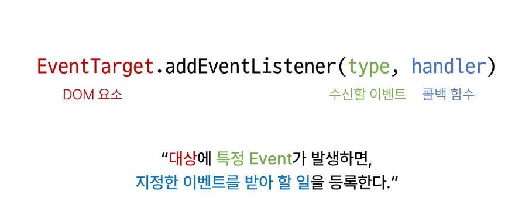

# 1026 온라인 실습

#### INDEX

```
1. 이벤트
2. event handler 활용
```

### 1. 이벤트

- 웹에서의 이벤트
    - 버튼을 클릭했을 때 팝업 창이 출력
    - 마우스 커서의 위치에 따라 드래그 앤 드롭하는 것
    - 사용자의 키보드 입력 값에 따라 새로운 요소를 생성하는 것

    - 일상에서의 이벤트 처럼 웹에서도 이벤트를 통해 특정 동작을 수행함


- 이벤트가 발생했을 때 실행되는 함수

#### .addEventListener() :

- 대표적인 이벤트 핸들러 중 하나
- EventTarget.addEventListener(type, handler)



- type
    - 수신할 이벤트 이름
    - 문자열로 작성(ex.'click')
- handler
    - 발생한 이벤트 객체를 수신하는 콜백함수
    - 콜백 함수는 발생한 Event object를 유일한 매개변수로 받음

#### 버블링
- 핸들러는 form 요소에 할당되어 있지만 div나 p요소 같은 중첩된 요소를 클릭해도 동작함
    - 왜 div나 p를 클릭했는데 form에 할당된 핸들러가 동작할까?

- 한 요소에 이벤트가 발생하면, 이 요소에 할당된 핸들러가 동작하고, 이어서 부모 요소의 핸들러가 동작하는 현상
- 가장 최상단의 조상 요소(document)를 만날 때 까지 이 과정이 반복되면서 요소 각각에 할당된 핸들러가 동작

    - 이벤트가 제일 깊은 곳에 있는 요소에서 시작해 부모요소를 거슬러 올라가며 발생하는 것이 마치 물속 거품과 닮았기 때문

    - 가장 안쪽의 <p> 요소를 클릭하면 p -> div -> form 순서로 3개의 이벤트 핸들러가 동작

- 이벤트가 정확히 어디서 발생했는지 접근할 수 있는 방법
    - event.target
    - event.currentTarget


- target 속성
    - 이벤트가 발생한 가장 안쪽의 요소(target)을 참조하는 속성
    - 실제 이벤트가 시작된 target 요소
    - 버블링이 진행되어도 변하지 않음

- currentTarget 속성
    - '현재'요소
    - 항상 이벤트 핸들러가 연결된 요소만을 참조하는 속성
    - 'this'와 같음


### 2. event handler

- 활용 실습
    - 1. 버튼 클릭 - 숫자 1씩 증가
    - 2. 사용자의 입력값 실시간 출력
    - 3. 사용자의 입력값 실시간 출력 - + 버튼 클릭시 출력값의 css 스타일 변경
    - 4. todo 프로그램 구현
    - 5. 로또 번호 생성기 구현

- currentTarget 주의 사항
    - console.log()로 event 객체를 출력할 경우 currentTarget 키의 값은 null을 가짐
    - currentTarget은 

- preventDefault()
    - 해당 이벤트에 대한 기본동작을 실행 하지 않도록 지정
    