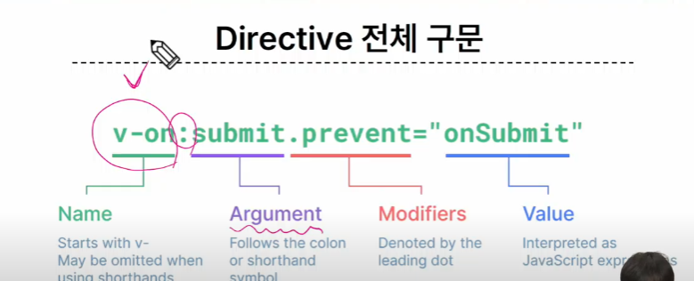

# 온라인 실습

INDEX

```
1. Template Syntax
2. Dynamically data binding
3. Event Handling
4. Form Input Bindings
```

### 1. Template Syntax


- DOM을 기본 구성 요소 인스턴스의 데이터에 선언적으로 바인딩(Vue Instanace와 DOM을 연결)할 수 있는 HTML 기반 템플릿 구문을 사용


- Template Syntax 종류

- 1. Text Interpolation
    - 텍스트 바인딩의 가장 기본적인 형태
    - 이중 중괄호 구문(콧수염 구문)을 사용
    - 콧수염 구문은 해당 구성 요소 인스턴스의 msg 속성 값으로 대체
    - msg 속성이 변경 될 때 마다 업데이트 됨
    ```
    <p>Message : {{ msg }}</p>
    ```
- 2. Raw HTML
    - 콧수염 구문은 일반텍스트로 해석하기 때문에 실제 html을 출력하려면 v-html을 사용해야함
- 3. Attribute Bindings
    - 콧수염 구문은 HTML 속성 내에서 사용할 수 없기 때문에 v-bind를 사용
    - HTML의 id 속성값ㅇ르 vue의 dynamicId 속성과 동기화 되도록 함
    - 바인딩 값이 null 이나 undefined인 경우 렌더링 요소에서 제거됨
- 4. JavaScript Expressions
    - Vue 는 모든 데이터 바인딩 내에서 JavaScript 표현식의 모든 기능을 지원
    - Vue 템플릿에서 JavaScript 표현식을 사용할 수 있는 위치
        - 1. 콧수염 구문 내부
        - 2. 모든 directive의 속성 값(v-로 시작하는 특수 속성)

- Expressions 주의사항
    - 각 바인딩에는 하나의 단일 표현식만 포함될 수 있음
        - 표현식은 값으로 평가할 수 있는 코드 조각
    - 작동하지 않는 경우
    ```
    표현식이 아닌 선언식
    {{const number = 1}}

    흐름제어도 작동하지 않음. 삼항 표현식을 사용
    {{if (ok) { return message }}}
    ```

- Directive
    - 'v-' 접두사가 있는 특수 속성

    - Directive의 속성 값은 단일 JavaScript 표현식이어야함
    - 표현식 값이 변경 될 때 DOM에 반응적으로 업데이트를 적용

    - 예시
        - v-if 는 seen 표현식 값의 T/F를 기반으로 <p>요소를 제거/ 삽입
            - <p v-if='seen'>Hi There</p>

    - 전체 구문

    

    - Argumnets
        - 일부 directive는 directive 뒤에 콜론으로 표시되는 인자를 사용할 수 있음
        - 아래예시의 href는 HTML a 요소의 href 속성 값을 myUrl값에 바인딩 하도록 하는 v-bind의 인자

    - Modifiers
        - .(dot)로 표시되는 특수 접미사로 , directive가 특별한 방식으로 바인딩 되어야 함을 나타냄
        - 예를 들어 .prevent는 발생한 이벤트에서 event.preventDefault()를 호출 하도록 v-on에 지시하는 modifier

    - BUILT-IN Directive


    - v-bind
        - 하나이상의 속성 또는 컴포넌트 데이터를 표현식에 동적으로 바인딩
    - 사용처
        - 1. Attribute Bindings
            - HTML의 속성값을 Vue의 상태 속성값과 동기화 되도록 함
            - v-bind shorthand(약어)
                - : (세미콜론)
            - Dynamic attribute name(동적 인자 이름)
                - 대괄호로 감싸서 directive argument에 JavaScript 표현식을 사용할 수도 있음
                - JavaScript 표현식에 따라 동적으로 평가된 값이 최종 argument 값으로 사용됨
                - 대괄호 안에 작성하는 이름은 반드시 소문자로만 구성가능
        - 2. Class and Style Bindings
            - 클래스와 스타일은 모두 속성이므로 v-bind를 사용하여 다른 속성과 마찬가지로 동적으로 문자열 값을 할당 할 수 있음
            - 그러나 단순히 문자열 연결을 사용하여 이런 값을 생성하는 것은 번거롭고 오류가 발생하기가 쉬움
            - Vue 는 클래스 및 스타일과 함께 v-bind를 사용 할 때, 객체 또는 배열을 활용한 개선 사항을 제공

            - 1. Binding HTML Classes
                - Binding to Objects
                - Binding to Arrays
                - :class를 배열에 바인딩 하여 클래스 목록을 적용할 수 있음
                ```
                const activeClass = ref('active')
                const infoClass = ref('text-primary')

                <div :class='[activeClass, infoClass]'>Text</div>

                ```
            - 2. Binding Inline Styles
                - Binding to Objects
                - Binding to Arrays


### 3. Event Handling

- v-on
    - handler 종류
        - 1. Inline handlers: 
            - Inline handlers는 주로 간단한 상황에 사용
            - 이벤트가 트리거 될 때 실행될 JavaScript 코드
            - method handlers : 컴포넌트에 정의된 메서드 이름
        - v-on shorthand(약어)
            - '@'

    - v-model
        - v-model을 사용하여 사용자 입력 데이터와 반응형 변수를 실시간 동기화

        