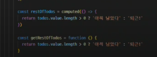

# 1106 온라인 실습


#### INDEX
```
1. Computed Property
2. Conditional Rendering
3. List Rendering
4. Watchers
5. Lifecycle Hooks
6. Vue Style Guide
```

### 1. Computed Properties

- computed()
  - 계산된 속성을 정의하는 함수
  - 미리 계산된 속성을 사용하여 템플릿에서 표현식을 단순하게 하고, 불필요한 연산을 줄임

- 특징
  - 반환되는 값은 computed ref 이며 일반 refs와 유사하게 계산된 결과를 .value로 참조할 수 있음(템플릿에서는 .value 생략 가능)
  - computed 속성은 의존된 반응현 데이터를 자동으로 추적
  - 의존하는 데이터가 변경될 때만 재평가
    - restofTodos의 계산은 todos에 의존하고 있음
    - 따라서 todos가 변경될 때만 restOfTodos가 업데이트 됨
    ```
    const restOfTodos = computed(()= > {
        return todos.value.length > 0 ? '아직 남았다': '퇴근!'
    })
    ```

- Computed vs methods




- computed 속성은 의존된 반응형 데이터를 기반으로 캐시 된다.
- 의존하는 데이터가 변경된 경우에만 재평가됨
- 즉, 의존된 반응형 데이터가 변경되지 않는 한 이미 계산된 결과에 대한 여러 참조는 다시 평가할 필요 없이 이전에 계산된 결과를 즉시 반환
  

- Cache(캐시)
  - 데이터나 결과를 일시적으로 저장해두는 임시 저장소
  - 이후에 같은 데이터나 결과를 다시 계산하지 않고 빠르게 접근할 수 있도록 함

- computed
  - 의존하는 데이터에 따라 결과가 바뀌는 계산된 속성을 만들때 응용
  - 동일한 의존성을 가진 여러곳에서 사용할 때 결과를 캐싱하여 중복 계산 방지
- method
  - 단순히 특정 동작을 수행하는 함수를 정의할 때 사용
  - 데이터에 의존하는지 여부와 관계없이 항상 동일한 결과를 반환하는 함수


- v-if
  - 표현식 값의 T/F를 기반으로 요소를 조건부로 렌더링

### 2. Conditional Rendering

#### v-if
- 표현식 값의 T/F를 기반으로 요소를 조건부로 렌더링
- v-else directive를 사용하여 v-if에 대한 else 블록을 나타낼 수 있다.

- 여러 요소에 대한 v-if 적용
  - v-if는 directive이기 때문에 단일요소에만 연결 가능
  - 이 경우 template 요소에 v-if 를 사용하여 하나 이상의 요소에 대해 적용할 수 있다.(v-else, v-else-if 모두 적용 가능)

#### v-show

- 표현식의 T/F를 기반으로 요소의 가시성(visibility)을 전환
- v-show 요소는 항상 렌더링 되어 DOM에 남아있음
- CSS display 속성만 전환하기 때문

```
const isShow = ref(false)

<div v-show='isShow'>v-show</div>
```

- v-if (Cheap initial load, expensive toggle)
    - 초기 조건이 false인 경우 아무 작업도 수행하지 않음
    - 토글 비용이 높음

- v-show (Expensive initial load, cheap toggle)
  - 초기 조건에 관계없이 항상 렌더링
  - 초기 렌더링 비용이 더 높음

- 무언가를 매우 자주 전환해야하는 경우에는 v-show를, 실행 중에 조건이 변경되지 않는 경우에는 v-if를 권장


### 3. List Rendering


- v-for
  - 소스 데이터를 기반으로 요소 또는 템플릿 블록을 여러번 렌더링
  - alias in expression 형식의 특수 구문을 사용하여 반복되는 현재 요소에 대한 별칭(alias)를 제공

```
<div v-for='item in items'>
    {{item.text}}
</div>
```


```
<div v-for="(item,index) in items"></div>

<div v-for='value in object'></div>
<div v-for='(value,key) in object'></div>
<div v-for='(value, key, index) in object'></div>
```


- 반드시 v-for과 key를 함께 사용한다
  - 내부 컴포넌트의 상태를 일관되게 유지
  - 데이터의 예측 가능한 행동을 유지(Vue 내부 동작 관련)

- key는 반드시 각 요소에 대한 고유한 값을 나타낼 수 있는 식별자여야 한다.

```
let id = 0

const items = ref([
    {id: id++, name='Alice'},
    {id: id++, name='Bella'},
])

<div v-for='item in items' :key='item.id'>
    <!-- content -->
</div>
```

- v-for with v-if
  - 동일 요소에 v-for와 v-if를 함께 사용하지 않는다.
  - 동일한 요소에서 v-if가 v-for보다 우선순위가 더 높기 때문

```
let id = 0

const todos = ref([
    {id: id++, name:'복습', isComplete: true},
    {id: id++, name:'예습', isComplete: false},
    {id: id++, name:'저녁식사', isComplete: true},
    {id: id++, name:'노래방', isComplete: false},
])

<ul>
    <li v-for='todo in todos' v-if='!todo.isComplete' :key='todo.id'>
        {{ todo.name }}
    </li>
</ul>
```

- todo 데이터 중 이미 처리한 (isComplete === true)todo만 출력하기

- 해결 방법 1
```
const completeTodos = computed(() => {
    return todos.value.filter((todo) => !todo.isComplete)
})

<ul>
    <li v-for='todo in completeTodos' :key='todo.id'>
        {{todo.name}}
    </li>
</ul>
```
- 해결 방법 2
```
<ul>
    <template v-for='todo in todos' :key='todo.id'>
        <li v-if='!todo.isComplete'>
            {{ todo.name }}
        </li>
    </template>
</ul>
```

### 4. Watchers

- 반응형 데이터를 감시하고, 감시하는 데이터가 변경되면 콜백 함수를 호출

- watch 구조

```
watch(variable, (newValue, oldValue) => {
    // do something
})
```

- variable
  - 감시하는 변수
- newValue
  - 감시하는 변수가 변화된 값
  - 콜백 함수의 첫번째 인자
- oldValue
  - 콜백 함수의 두번째 인자

- watch 예시
  - 1. 감시하는 변수에 변화가 생겼을 때 기본 동작 확인 하기


  - 2. 감시하는 변수에 변화가 생겼을 때 연관 데이터 업데이트 하기


- Computed 와 Watchers


### 5. Lifecycle Hooks
- Vue 인스턴스의 생애주기 동안 특정 시점에 실행되는 함수
  - 개발자가 특정 단계에서 의도하는 로직이 실행될 수 있도록 함`