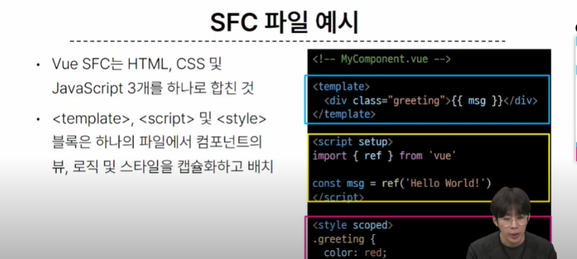
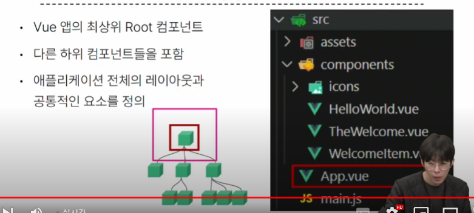
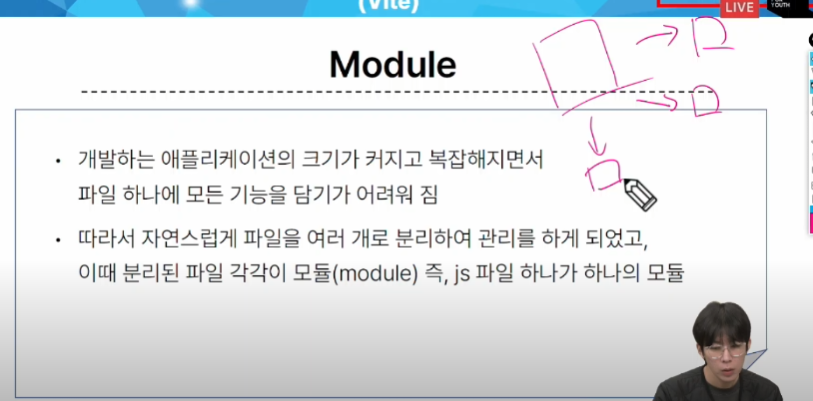

# 1107 온라인 실습

#### INDEX

```
1. Single-File Components
2. SFC build tool
3. Vue Component
```


## 1. Single-File Components

- Component
  - 재사용 가능한 코드 블록
  - UI를 독립적이고 재사용 가능한 일부분으로 분할하고 각 부분을 개별적으로 다룰 수 있다.
  - 그러면, 자연스럽게 앱은 중첩된 Component의 트리로 구성된다.
  - 웹 서비스는 여러개의 Component로 이루어져 있음


#### Single-File Components
- 컴포넌트의 템플릿, 로직 및 스타일을 하나의 파일로 묶어낸 특수한 파일 형식(*.vue)

- Vue SFC는 HTML, CSS, 및 JavaScript 3개를 합친것


## 2. SFC build tool

- Node Package Manager(NPM)
  - Node.js의 기본 패키지 관리자

- Node.js의 영향
  - 기존에 브라우저 안에서만 동작할 수 있었던 JavaScript를 브라우저가 아닌 서버측에서도 실행 할 수 있게 함
    - 프론트엔드와 백엔드에서도 동일한 언어로 개발 할 수 있게 됨


- node_modules 
  - Node.js 프로젝트에는 사용되는 외부 패키지들이 저장되는 디렉토리
  - 프로젝트의 의존성 모듈을 저장하고 관리하는 공간
  - 프로젝트가 실행될 때 필요한 라이브러리와 패키지들을 포마
  - .gitignore에 작성됨

- public 디렉토리
  - 주로 다음 정적 파일을 위치시킨다
    - 소스코드에서 참조되지 않는
    - 항상 같은 이름을 갖는
    - import 할 필요없느
  - 항상 root 절대경로를 사용하여 참조
    - public/icon.png는 소스코드에서 /icon.png로 참조가능
- src 디렉토리
  - 프로젝트의 주요 소스 코드를 포함하는 곳
  - 컴포넌트, 스타일, 라우팅 등 프로젝트의 핵심 코드를 관리

- src/assets
  - 프로젝트 내에서 사용되는 자원(이미지, 폰트, 스타일시트)을 관리
  - 컴포넌트 자체에서 참조하는 내부 파일을 저장하는데 사용
  - 컴포넌트가 아닌곳에서는 public 디렉토리에 위치한 파일을 사용
- src/components
  - Vue 컴포넌트 작성하는 곳
- src/App.Vue
  - Vue 앱의 최상위 ROOT 컴포넌트 
  - 다른 하위 컴포넌트들을 포함
  - 애플리케이션 전체의 레이아웃과 공통적인 요소를 정리

  
- src/main.js
  - Vue 인스턴스를 생성하고, 애플리케이션을 초기화 하는 역할
  - 필요한 라이브러리를 import 하고 전역 설정을 수행
- index.html
  - Vue앱의 기본 HTML 파일
  - 앱의 진입점
  - Root 컴포넌트인 App.vue가 해당 페이지에 마운트 됨
  - 필요한 스타일 시트, 스크립트등 외부 리소스를 로드 할 수 있다.


- MODULE
  - 프로그램을 구성하는 독립적인 코드 블록

  
- BUNDLER
  - 여러 모듈과 파일을 하나의 번들로 묶어 최적화하여 애플리케이션에서 사용할 수 있게 만들어주는 도구


## 3. Vue Component

1. 컴포넌트 파일 생성
    - 1. 초기에 생성된 모든 컴포넌트 삭제
    - 2. App.vue 코드 초기화
    - 3. MyComponent.vue생성
    - 4. App 컴포넌트에 MyComponent를 등록
2. 컴포넌트 등록(IMPORT)    
    - 1. App(부모) - MyComponent(자식) 관계 형성
      - @- 'src/'경로를 뜻하는 약어