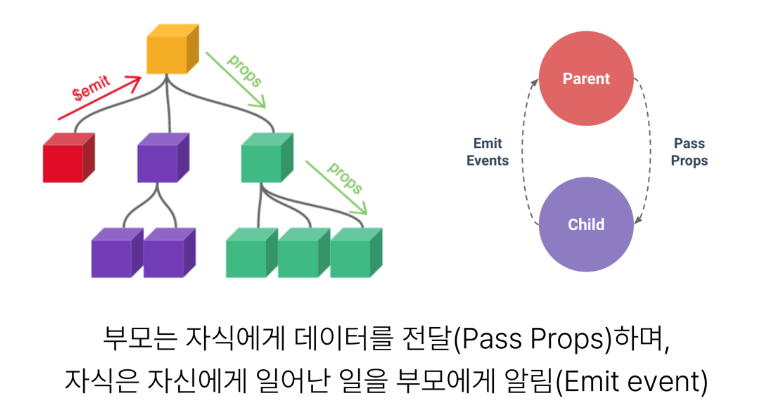
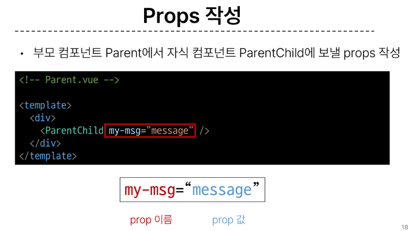
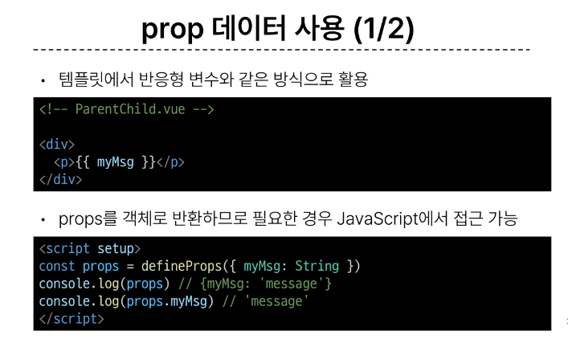
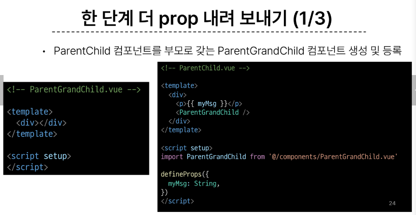
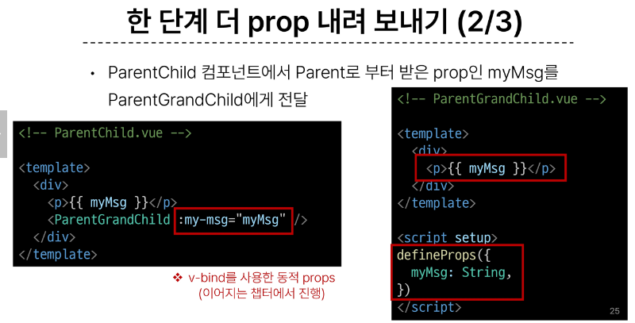
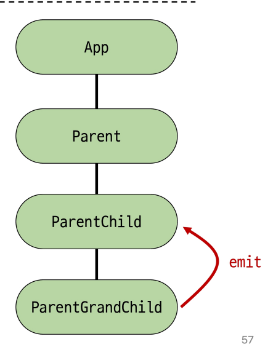
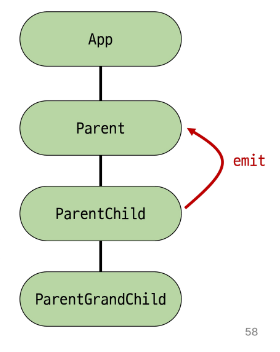

# 1108 온라인 실습

#### INDEX
```
1. Passing Props
2. Component Events
```

## 1. Passing Props
- 같은 데이터 하지만 다른 컴포넌트
  - 동일한 사진 데이터가 한 화면에 다양한 위치에서 여러번 출력되고 있음
  - 하지만 해당 페이지를 구성하는 컴포넌트가 여러개라면 각 컴포넌트가 개별적으로 동일한 데이터를 관리해야할까?
  - 그렇다면 사진을 변경해야할 때 모든 컴포넌트에 대한 변경 요청을 해야함
    - 공통된 부모 컴포넌트에서 관리하자


- Props 
  - 부모 컴포넌트로부터 자식 컴포넌트로 데이터를 전달하는데 사용되는 속성
- One-Way Data Flow
  - 모든 props는 자식 속성과 부모 속성 사이에 하향식 단방향 바인딩을 형성
- 부모 속성이 업데이트되면 자식은 흐르지만 그 반대는 안됨
- 즉, 자식 컴포넌트 내부에서 props를 변경하려고 시도해서는 안되며 불가능
- 또한 부모 컴포넌트가 업데이트 될 때마다 자식 컴포넌트의 모든 props가 최신값으로 업데이트 됨
  - 부모 컴포넌트에서만 변경하고 이를 내려받는 자식 컴포넌트는 자연스럽게 갱신

- 단방향인 이유
  - 하위 컴포넌트가 실수로 상위 컴포넌트의 상태를 변경해 앱에서의 데이터 흐름을 이해하기 어렵게 만드는 것을 방지

- Props 선언
  - 부모 컴포넌트에서 보낸 props를 사용하기 위해서는 자식 컴포넌트에서 명시적인 props 선언이 필요



#### Props 선언 방식 2가지
- 1. 문자열 배열을 사용한 선언
  - defineProps()를 사용하여 props를 선언
```
<!--ParentChild.vue-->

<script setup>
defineProps(['myMsg'])
</script>
```
- 2. 객체를 사용한 선언 < 유효성 검사 >
  - 객체 선언 문법의 각 객체 속성의 키는 props의 이름이 되며, 객체 속성의 값은 값이 될 데이터의 타입에 해당하는 생성자 함수(Number, String..)여야 함
    - 객체 선언 문법 사용 권장
```
<!--ParentChild.vue-->

<script setup>
defineProps({
    myMsg: String
})
</script>
```




#### 한 단계 더 prop 내려 보내기
- ParentChild 컴포넌트를 부모로 갖는 ParentGrandChild 컴포넌트 생성 및 등록




- v-bind를 이용한 동적 props


#### Props 세부 사항
1. Props Name Casing(Props 이름 컨밴션)
    - 선언 및 템플릿 참조시(->camelCase)
    - ```
        <p>{{myMsg}}</p>

        defineProps({
            myMsg : String,
        })
      ```
    - 자식 컴포넌트로 전달시(->kebab-case)
    - ```
        <ParentChild my-msg='message' />
      ```
2. Static Props & Dynamic Props
   - 지금까지 작성한 것은 Static Props
   - v-bind를 사용하여 동적으로 할당된 props를 사용할 수 있다.
     - 1. Dynamic Props 정의
        ```
        <!--Parent.vue-->

        import { ref } from 'vue'

        const name = ref('Alice')

        <ParentChild my-msg='message' :dynamic-props='name' />
        ``` 
     - 2. Dynamic Props 선언 및 출력
        ```
        <!--ParentChild.vue-->

        defineProps({
            myMsg: String,
            dynamicProps: String,
        })

        <p>{{dynamicProps}}</p>
        ```
## 2. Component Events

- 부모는 자식에게 데이터를 전달(Pass Props)하며, 자식은 자신에게 일어난 일을 부모에게 알림(Emit event)
- 부모가 prop 데이터를 변경하도록 소리쳐야한다.

- $emit()
  - 자식 컴포넌트가 이벤트를 발생시켜 부모 컴포넌트로 데이터를 전달하는 역할의 메소드
  - '$' 표기는 Vue 인스턴스나 컴포넌트 내에서 제공되는 전역 속성이나 메서드를 식별하기 위한 접두어
- 메소드 구조
> $emit(evet, ...args)

- event 
  - 커스텀 이벤트 이름
- args
  - 추가 인자


#### Event 발신 및 수신
- $emit을 사용하여 템플릿 표현식에서 직접 사용자 정의 이벤트를 발신
> <button @click="$emit('someEvent')">클릭</button>

- 그러면 부모는 v-on을 사용하여 수신할 수 있음
> <ParentComp @some-event="someCallback" />'


- emit 이벤트 선언
  - defineEmits()를 사용하여 명시적으로 발신할 이벤트를 선언 할 수 있음
  - script에서 $emit 메서드를 접근 할 수 없기 떄문에 defineEmits()는 $emit 대신 사용할 수 있는 동등한 함수를 반환

```
<script setup>
const emit = defineEmits(['someEvent', 'myFocus'])

const buttonClick = functino () {
    emit('someEvent')
}
</script>
```

- event 인자
  - 이벤트 발생 시 추가 인자를 전달하여 값을 제공할 수 있음
    - 이벤트 인자 전달하기
    - ParentChild에서 이벤트를 발신하여 Parent로 추가 인자 전달하기

    ```
    <!--ParentChild.vue-->

    const emit = defineEmits(['someEvent', 'emitArgs'])

    const emitArgs = function() {
        emit('emitArgs',1,2,3)
    }

    <!--ParentChild.vue-->

    <button @click='emitArgs'>추가 인자 전달</button>
    ```

    - ParentChild에서 발신한 이벤트를 Parent에서 수신

    ```
    <!--Parent.vue-->

    <ParentChild
        @some-event='someCallback'
        @emit-args='getNumbers'
        my-msg='message'
        :dynamic-props='name'
    />

    <!--Parent.vue-->

    const getNumbers = function(...args) {
        console.log(args)
        console.log(`ParentChild가 전달한 추가인자 ${args}를 수신했어요.`)
    }
    ```

### Emit 이벤트 실습

- 최하단 컴포넌트 ParentGrandChild에서 Parent 컴포넌트의 name 변경 요청하기


- 1. ParentGrandChild에서 이름 변경을 요청하는 이벤트 발신

```
<!--ParentGrandChild.vue-->

const emit = defineEmits(['upadateName'])

const updateName = function() {
    emit('updateName')
}

<!--ParentGrandChild.vue-->

<button @click='updateName'>이름 변경</button>
```



- 2. 이벤트 수신 후 이름 변경을 요청하는 이벤트 발신

```
<!--ParentChild.vue-->

<ParentGrandChild
@update-name='updateName'
/>

<!--ParentChild.vue-->

const emit = defineEmits(['updateName'])

const updateName = function() {
    emit('updateName')
}
```



- 3. 이벤트 수신 후 이름 변수 변경 메서드 호출
  - 해당 변수를 prop으로 받는 모든 곳에서 자동 업데이트

```
<!--Parent.vue-->

<ParentChild @update-name='updateName'/>

<!--Parent.vue-->

const updateName = function() {
    name.value = 'Bella'
}
```