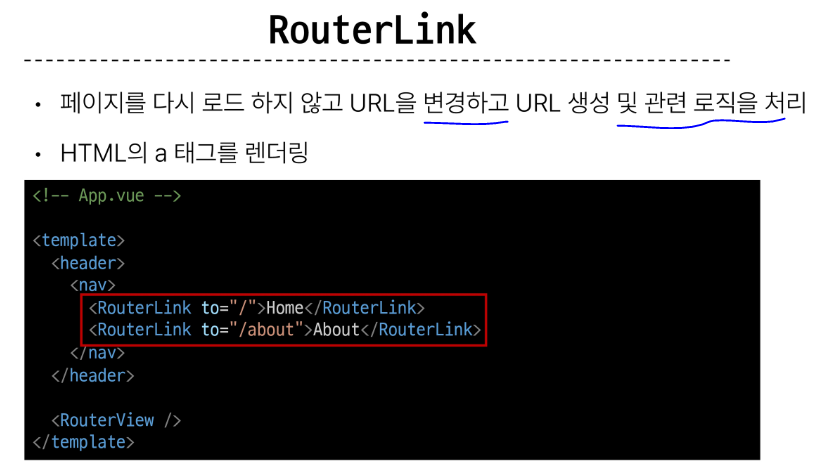
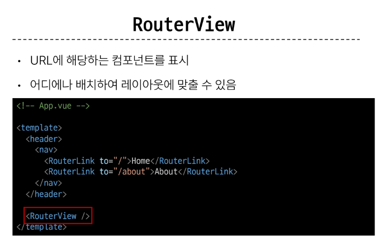
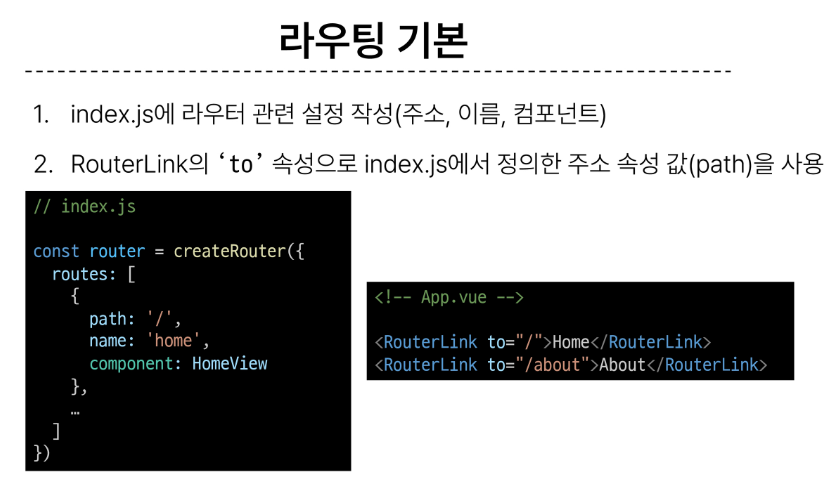
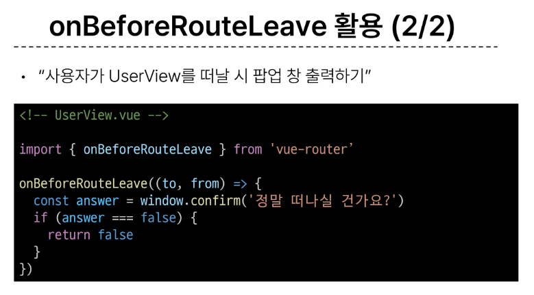
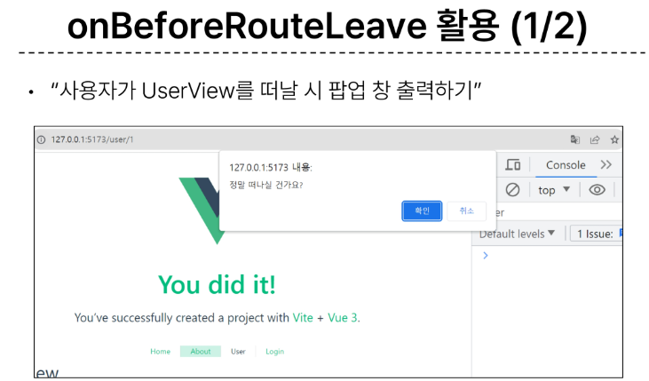
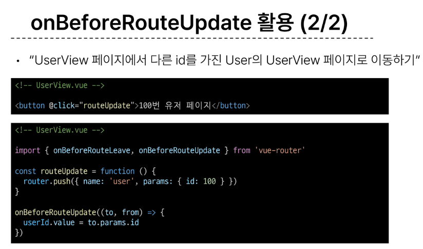
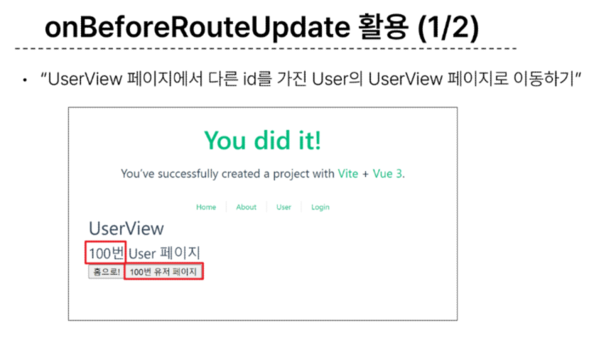
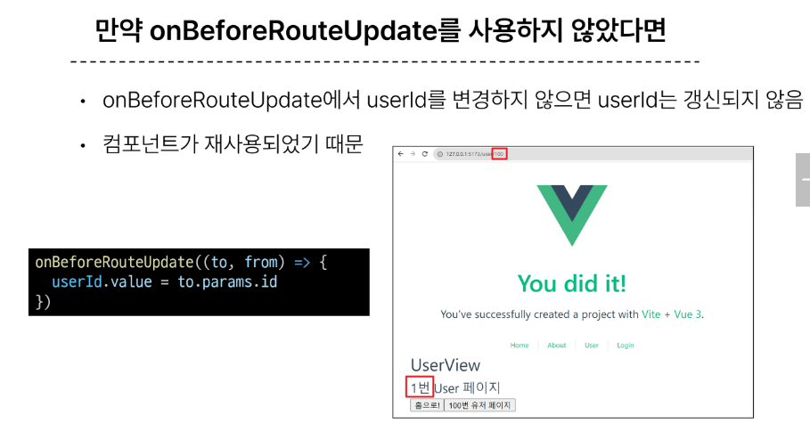

# 1109 온라인 실습

#### INDEX
```
1. Routing
2. Vue Router
3. Navigation Guard
```

### 1. Routing

- 네트워크에서 경로를 선택하는 프로세스
  - 웹 애플리케이션에서 다른 페이지 간의 전환과 경로를 관리하는 기술

- SSR에서의 Routing
  - 서버가 사용자가 방문한 URL 경로를 기반으로 응답을 전송
  - 링크를 클릭하면 브라우저는 서버로부터 HTML 응답을 수신하고 새 HTML로 전체 페이지를 다시 로드

- CSR/SPA에서의 Routing
  - SPA에서 routing은 브라우저의 클라이언트 측에서 수행
  - 클라이언트 측 JavaScript가 새 데이터를 동적으로 가져와 전체 페이지를 다시 로드 하지 않음
  - 페이지는 1개이지만 링크에 따라 여러 컴포넌트를 렌더링 하여 마치 여러 페이지를 사용하는 것처럼 보이도록 해야함

- 만약 routing이 없다면
  - 유저가 URL을 통한 페이지의 변화를 감지할 수 없음
  - 페이지가 무엇을 렌더링 중인지에 대한 상태를 알 수 없음
    - URL이 1개이기 때문에 새로 고침시 처음 페이지로 되돌아감
    - 링크를 공유할 시 첫 페이지만 공유 가능
  - 브라우저의 뒤로 가기 기능을 사용할 수 없음


### 2. Vue Router

- Vue 공식 라우터(The official Router for Vue.js)

- 서버 실행 후 Router로 인한 프로젝트 변화
  - Home, About 링크에 따라 변경되는 URL과 새로 렌더링 되는 화면

- RouterLink
  - 페이지를 다시 로드 하지 않고 URL을 변경하고 URL 생성 및 관련 로직을 처리 
  - HTML의 a 태그를 렌더링


- RouterView
  - URL에 해당하는 컴포넌트를 표시
  - 어디에나 배치하여 레이아웃에 맞출 수 있음



- router/index.js
  - 라우팅에 관련된 정보 및 설정이 작성되는 곳
  - router에 URL과 컴포넌트를 매핑

- views
  - RouterView 위치에 렌더링 할 컴포넌트를 배치
  - 기존 components 폴더와 기능적으로 다른것은 없으며 단순 분류의 의미로 구성됨
    - 일반 컴포넌트와 구분하기 위해 컴포넌트 이름을 View로 끝나도록 작성하는 것을 권장

- 라우팅 기본
  - 1. index.js에 라우터 관련 설정 작성(주소, 이름, 컴포넌트)
  - 2. RouterLink의 'to' 속성으로 index.js에서 정의한 주소 속성 값(path)를 사용




- Named Routes
  - 경로에 이름을 지정하는 라우팅
  - name 속성 값에 경로에 대한 이름을 지정
  - 경로에 연결하려면 RouterLink에 v-bind를 사용해 'to' prop 객체로 전달

- Dyanmic Route Matching with Params
  - 매개변수를 사용한 동적 경로 매칭
    - 주어진 패턴 경로를 동일한 컴포넌트에 매핑해야하는 경우 활용
    - 예를 들어 모든 사용자의 ID를 활용해 프로필 페이지 url을 설계한다면?
      - user/1
      - user/2
      - user/3
      - 일정한 패턴의 URL 작성을 반복해야함
- 1. UserView 컴포넌트 작성
- 2. UserView 컴포넌트 라우트 등록
  - 매개변수는 콜론(:)으로 표기
  
- Programmatic Navigation
  - router의 인스턴스 메서드를 사용해 RouterLink로 a태그를 만드는 것처럼 프로그래밍으로 네비게이션 관련 작업을 수행할 수 있다.

- 1. 다른 위치로 이동하기
  - router.push()
    - 다른 URL로 이동하는 메서드
    - 새 항목을 history stack에 push하므로 사용자가 브라우저 뒤로 가기 버튼을 클릭하면 이전 URL로 이동할 수 있다.
    - RouterLink를 클릭했을 때 내부적으로 호출되는 메서드 이므로 RouterLink를 클릭하는 것은 router.push()를 호출하는 것과 같음
      - 선언적 : RouterLlink :to='...'
      - 프로그래밍적 : router.push(...)
- 2. 현재 위치 바꾸기
  - router.replace()
  - push 메서드와 달리 history stack에 새로운 항목을 push 하지 않고 다른 URL로 이동(=== 이동전 URL로 뒤로 가기 불가)
    - 선언적: RouterLink :to='...' replace
    - 프로그래밍적: router.replace(...)


### 3. Navigation Guard

- vue router를 통해 특정 URL에 접근할 때 다른 URL로 redirect 하거나 취소하여 네비게이션을 보호
  - 인증 정보가 없으면 특정 페이지에 접근하지 못하게 함

#### Navigation 종류
1. Globally(전역 가드)
   - 애플리케이션 전역에서 동작
   - index.js에서 정의
2. Per-route(라우터 가드)
   - 특정 route에서만 동작
   - index.js의 각 routes에 정의
3. In-component(컴포넌트 가드)
   - 특정 컴포넌트내에서만 동작
   - 컴포넌트 script에 정의

- router.beforeEach()
  - 다른 URL로 이동하기 직전에 실행되는 함수

#### router.beforeEach()의 구조
- to : 이동할 URL 정보가 담긴 Route 객체
- from : 현재 URL 정보가 담긴 Route 객체
- 선택적 반환(return) 값
  - 1. false
    - 현재 네비게이션을 취소
    - 브라우저 URL이 변경된 경우(사용자가 수동으로 또는 뒤로 버튼을 통해) from 경로의 URL로 재설정
  - 2. Route Location
    - router.push()를 호출하는 것처럼 경로 위치를 전달하여 다른 위치로 redirect

```
router.beforeEach((to,from) => {
    ...return false
})
```
- router.beforeEnter()
  - route에 진입했을 때만 실행되는 함수
    - 매개변수, 쿼리 값이 변경될 때는 실행되지 않고 다른 경로에서 탐색할 때만 실행됨

- '이미 로그인 한 상태라면 LoginView 진입을 막고 HomeView로 이동 시키기'

#### In-component Guard
- onBeforeRouteLeave
  - 현재 라우트에서 다른 라우트로 이동하기 전에 실행
    - 사용자가 현재 페이지를 떠나는 동작에 대한 로직을 처리
- onBeforeRouteUpdate
  - 이미 렌더링된 컴포넌트가 같은 라우트 내에서 업데이트 되긴 전에 실행
    - 라우트 업데이트 시 추가적인 로직을 처리

#### onBeforeRouteLeave 활용




#### onBeforeRouteUpdate 활용





- 만약 onBeforeRouteUpdate를 사용하지 않았다면
  - onBeforeRouteUpdate에서 userId를 변경하지 않으면 userId는 갱신되지 않음
  - 컴포넌트가 재사용되었기 떄문




***
- 참고
  
### Lazy Loading Routes
- 첫 빌드시 해당 컴포넌트를 로드하지 않고, 해당 경로를 처음으로 방문할 때만 컴포넌트를 로드하는 것
  - 앱을 빌드할 때 앱의 크기에 따라 페이지 로드시간이 길어질 수 있기 때문
- 기존에 '정적 가져오기 방식'을 '동적 가져오기 방식'으로 변경하는 것과 같음


