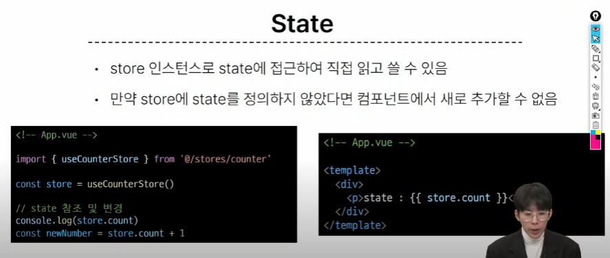
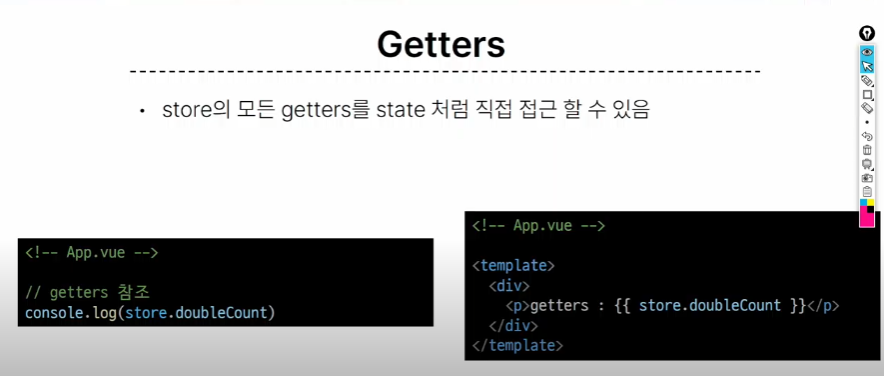

# 1113 온라인 실습


#### INDEX
```
1. State Management
```


### 1. State Management

- 상태(state)
  - 앱 구동에 필요한 기본 데이터

- 뷰(View)
  - 상태를 선언적으로 매핑하여 시각화

- 기능(Actions)
  - 뷰에서 사용자입력에 대해 반응적으로 상태를 변경할 수 있게 정의된 동장

- 단방향 데이터 흐름의 간단한 표현

- 상태 관리의 단순성이 무너지는 시점
  - 여러 컴포넌트가 상태를 공유할 때

#### 상태 관리의 단순성이 무너지는 시점
- 여러 컴포넌트가 상태를 공유 할 때
    - 여러 뷰가 동일한 상태에 종속되는 경우
      - 공유 상태를 공통 조상 컴포넌트로 끌어올린 다음 props로 전달하는 것
      - 하지만 계층 구조가 깊어질 경우 비효율적, 관리가 어려워짐
    - 서로 다른 뷰의 기능이 동일한 상태를 변경시켜야하는 경우
      - 발신된 이벤트를 통해 상태의 여러 복사본을 변경 및 동기화 하는것
      - 마찬가지로 관리의 패턴이 깨지기 쉽고 유지 관리할 수 없는 코드가 됨

#### 해결책
- 각 컴포넌트의 공유 상태를 추출해 전역에서 참조할 수 있는 저장소에서 관리
- 컴포넌트 트리는 하나의 큰 '뷰'가 되고 모든 컴포넌트는 트리 계층 구조에 관계없이 상태에 접근하거나 기능을 사용할 수 있다
- Vue의 공식 상태 관리 라이브러리 === Pinia


### Pinia

1. store
   - 중앙 저장소
   - 모든 컴포넌트가 공유하는 상태, 기능 등이 작성됨 
2. state
   - 반응형 상태(데이터)
   - ref() === state 
3. getters
   - 계산된 값
   - computed() === getters
4. actions
   - 메서드
   - function() === actions 
5. plugin
   - 애플리케이션의 상태관리에 필요한 추가기능을 제공하거나 확장하는 도구나 모듈
   - 애플리케이션의 상태관리를 더욱 간편하고 유연하게 만들어주며, 패키지 매니저로 설치 이후 별도 설정을 통해 추가됨

- Pinia 구성 요소의 활용



- store 인스턴스로 state에 접근해 직접 읽고 쓸수 있다
- 만약 store에 state를 정의하지 않았다면 컴포넌트에서 새로 추가할 수 없다.

- getters
  - store의 모든 getters를 state처럼 직접 접근 할 수 있다.



- Actions
  - store의 모든 actions를 직접 접근 및 호출 할 수 있다
  - getters와 달리 state 조작, 비동기, API 호출이나 다른 로직을 진행할 수 있다.


